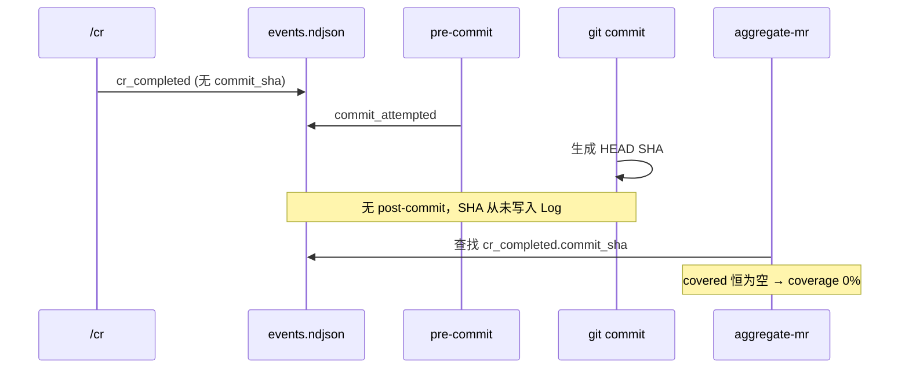
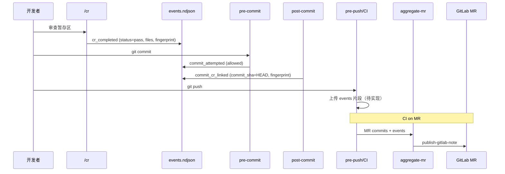

## Why

`aicr-local` 已经通过 `/cr` 命令提供提交前代码自检能力，但当前团队无法回答两个关键问题：

1. 开发在真实提交流程中是否执行了 `/cr`；
2. 开发忘记执行 `/cr` 时，是否可以在提交动作发生前被及时提醒。

团队在试行后确认：仅软提醒会出现「当次漏检仍可提交」的风险，需要默认阻断并保留可审计的显式跳过能力。后续还需在 MR 维度统计「哪些 commit 在提交前做过 `/cr`」，供 Reviewer 可见。

## What Changes

### 已实现（本地 pre-commit 门禁）

- 新增 `aicr-precommit-reminder` 能力：在 `git commit` 时自动检查有效 `/cr` 证据；
- **per-commit 门禁**（非时间窗）：同 `repo/branch/author` 下，最近一次 `cr_completed` 须晚于最近一次 `commit_attempted` / `commit_blocked_without_cr` / `commit_bypassed_cr`；
- **`validate-cr-gate.mjs` 硬校验**：`cr_completed.status=pass`、`files` 与暂存区一致、`diff_fingerprint` 匹配；
- 审查有 🔴/🟠 时**禁止**写 `status=pass` 的 `cr_completed`；Agent **禁止**擅自改代码后提交（`cr-before-commit.mdc`）；
- 缺少证据时默认阻断（`AICR_ENFORCEMENT_MODE=hard`），可 `AICR_BYPASS_CR=1` 显式跳过并审计；
- 事件日志默认 `.git/aicr/events.ndjson`（`AICR_EVENT_LOG` 可覆盖）；
- 安装入口 `/cr-setup` + `cr-precommit-setup` skill + `install.sh`（同步 hook、脚本、**仅** `cr-before-commit.mdc` rule；**不同步** `/commit`，避免覆盖团队版 Command）；
- `aicr-local` 步骤 11 与 pre-commit 协同；可选写 `cr_failed` 事件。

### 部分实现（MR 覆盖率，端到端未通）

- `aggregate-mr.mjs`：输入 MR commit 列表 + 事件日志，输出覆盖率 JSON（脚本骨架已有）；
- `publish-gitlab-note.mjs`：将聚合结果幂等写入 GitLab MR comment（脚本已有，**无 CI 接线**）；
- **缺口**：`commit_sha` 关联、post-commit hook、events 上传 CI、GitLab pipeline — 见下文「MR 覆盖率设计」。

### 待实现

- post-commit 写入 `commit_cr_linked`（或等效）完成 `/cr` ↔ commit SHA 绑定；
- 改 `aggregate-mr.mjs` 聚合逻辑 + 仅计 `status=pass`；
- events 从开发者本地进入 CI 的传输方案；
- GitLab CI job 模板（MR pipeline 触发聚合 + comment）；
- hook 异常时 `telemetry_error` 放行（spec 已定义，代码未实现）；
- 飞书辅通道通知（可选）。

## Implementation Status（代码 ↔ 文档对齐）

| 资产路径 | 状态 | 说明 |
|----------|------|------|
| `plugins/common/assets/cr-precommit/hook-pre-commit.sh` | ✅ | pre-commit 门禁、bypass、soft/hard |
| `plugins/common/assets/cr-precommit/validate-cr-gate.mjs` | ✅ | per-commit + fingerprint + status=pass |
| `plugins/common/assets/cr-precommit/event-log.mjs` | ✅ | append-only NDJSON，自动 fingerprint |
| `plugins/common/assets/cr-precommit/schema.json` | ✅ | 含 `cr_failed`、`status`、`commit_sha` 等字段 |
| `plugins/common/assets/cr-precommit/install.sh` | ✅ | `.githooks` + rule；不含 `/commit` |
| `plugins/common/rules/cr-before-commit.mdc` | ✅ | Agent 门禁 + 禁止擅自修复 |
| `plugins/common/commands/cr-setup.md` | ✅ | 安装命令 |
| `plugins/common/skills/cr-precommit-setup/SKILL.md` | ✅ | 安装 skill |
| `plugins/common/skills/aicr-local/SKILL.md` | ✅ | 步骤 10–11、status=pass |
| `plugins/common/assets/cr-precommit/aggregate-mr.mjs` | ⚠️ | 脚本可跑，但依赖未写入的 `commit_sha` |
| `plugins/common/assets/cr-precommit/publish-gitlab-note.mjs` | ⚠️ | 脚本可 dry-run，无 CI 集成 |
| post-commit / `commit_cr_linked` | ❌ | 未实现 |
| events → CI 传输 | ❌ | 未设计落地 |
| `telemetry_error` 兜底 | ❌ | spec 有，hook 未实现 |

## Capabilities

### New Capabilities

- `aicr-precommit-reminder`：本地 pre-commit 默认阻断与事件采集（**已实现**）。
- `aicr-mr-coverage-aggregation`：基于事件日志聚合 MR 覆盖率（**部分实现，端到端待补**）。
- `aicr-setup-installation`：面向业务仓库的一次性安装与自检入口（**已实现**）。

### Modified Capabilities

- `aicr-local`：补充 pre-commit 协同、`status=pass` 写入、有问题时禁止提交（**已实现**）。

## Detailed Invocation Flow（人 + 自动）

### 一次性安装阶段（人调用）

1. 仓库管理员或开发负责人执行 `/cr-setup`（或 `install.sh`）。
2. 安装 `.githooks/aicr/*`、`pre-commit` launcher、`core.hooksPath=.githooks`。
3. 同步 `cr-before-commit.mdc` 到 `.cursor/rules/`（**不**安装 `/commit`）。
4. 人工执行 smoke test（`event-log --self-check`、`validate-cr-gate --self-check`、无 cr 时 pre-commit 阻断）。

### 日常开发阶段（人触发 + 自动执行）

1. 开发者 `git add` 并执行 `/cr`（完整 `aicr-local` 流程）。
2. 审查结论 `✅ 无明显问题` → 写 `cr_completed`（`status=pass`，含 `files` / `diff_fingerprint`）；有 🔴/🟠 → **不写 pass**，提交阻断。
3. 开发者执行团队 `/commit` 或 `git commit`。
4. pre-commit 调用 `validate-cr-gate.mjs`：通过则写 `commit_attempted(status=allowed)` 并放行；否则阻断或 soft 警告。
5. `AICR_BYPASS_CR=1` 时放行并写 `commit_bypassed_cr`（可选 `AICR_BYPASS_REASON`）。

### MR 统计阶段（目标流程，待端到端落地）

1. 开发者 push 后，CI 获取 MR commit 列表（GitLab API）。
2. CI 获取该 MR 相关 **events**（见 MR 覆盖率设计 — 本地 `.git/aicr/` 不会随 push 上传）。
3. `aggregate-mr.mjs` 计算 `total_commits` / `covered_commits` / `coverage_rate` / `missing_commits`。
4. `publish-gitlab-note.mjs` 将结果写入 MR comment（marker `<!-- aicr-coverage -->` 幂等更新）。

## MR 覆盖率设计

> 本节为 `/fe-sdd` 设计结论：补齐「审查事件 ↔ commit SHA ↔ CI 可读」三段链路。

### 问题诊断（当前为何恒为 0%）



**断点 1 — 关联键缺失**：`/cr` 在 commit **之前**执行，此时无 SHA；`aggregate-mr.mjs` 却只认 `cr_completed.commit_sha`。

**断点 2 — 日志不可达**：events 存于 `.git/aicr/events.ndjson`，不随 `git push` 到 GitLab，MR 上的 CI clone 读不到开发者本机日志。

### 设计决策

| 决策 | 选择 | 理由 |
|------|------|------|
| SHA 绑定时机 | **post-commit hook** | pre-commit 阶段 SHA 尚不存在；与 ndjson append-only 模型一致 |
| 关联事件形态 | 新增 **`commit_cr_linked`** | 不修改历史 `cr_completed` 行；携带 `commit_sha`、`diff_fingerprint`、可选 `cr_timestamp` |
| 覆盖判定 | `commit_cr_linked.commit_sha` ∈ MR commits，且对应 CR 为 **pass** | 与 pre-commit 门禁语义一致 |
| 一致性级别 | **L1 弱一致** | rebase/amend/ cherry-pick 可能导致关联偏移；MR 统计作趋势参考，不作 merge 硬门禁 |
| events 进 CI | **push 时上传**（首选待试点） | 如 pre-push 将 ndjson 片段上传 Job Artifact / 内部 API；备选方案见 spec |
| GitLab 输出 | `publish-gitlab-note.mjs` + MR pipeline | 已有脚本，补 CI job 即可 |
| 飞书 | 辅通道，后续 | 仅摘要：覆盖率、缺失数、MR 链接 |

### 目标事件流（补全后）



### post-commit 行为（待实现）

commit 成功后：

1. 读取 `HEAD` SHA、`repo`（basename）、`branch`、`author`（email）；
2. 在同上下文中找**最近一条** `cr_completed(status=pass)`，且尚无对应 `commit_cr_linked`；
3. 追加：

```json
{
  "event": "commit_cr_linked",
  "commit_sha": "<HEAD>",
  "diff_fingerprint": "<from cr_completed>",
  "repo": "...",
  "branch": "...",
  "author": "...",
  "status": "pass"
}
```

4. 若 `AICR_BYPASS_CR=1` 跳过审查的 commit，**不**写 `commit_cr_linked`（或写 `status=bypassed` 且不计入覆盖）。

### aggregate-mr 行为（待改）

- `covered` = MR commit 列表 ∩ { `commit_cr_linked.commit_sha` | `status=pass` 或未设 status }
- 兼容期：若存在带 `commit_sha` 的 `cr_completed` 也计入（向后兼容手工测试）
- 输出格式不变：`total_commits`、`covered_commits`、`coverage_rate`、`missing_commits`、`updated_at`

### events 传输（待选型落地）

| 方案 | 说明 | 优先级 |
|------|------|--------|
| A. pre-push 上传 Artifact/API | push 时将自上次 push 以来的 events 行上传；CI 按 MR 作者+分支拉取 | **试点首选** |
| B. 仓库内 `.aicr/events/` 按作者 append | 可 push，但易冲突、隐私与体积问题 | 备选 |
| C. CI 仅统计 pipeline 内 clone | 无法反映开发者本机 `/cr`，不适用 | 否决 |

### CI job 草图（待实现）

触发：`merge_request_event`

1. 获取 MR commits → `mr-commits.json`
2. 获取 events 文件 → `$EVENTS_FILE`（来自 artifact/API）
3. `node .githooks/aicr/aggregate-mr.mjs --events "$EVENTS_FILE" --commits "$(jq -c '[.[].id]' mr-commits.json)"` → `coverage.json`
4. `node .githooks/aicr/publish-gitlab-note.mjs --project-id "$CI_PROJECT_ID" --mr-iid "$CI_MERGE_REQUEST_IID" --report-file coverage.json`

**与业务已有 CI 的关系**：不替换现有 pipeline；通过 **local/remote include** 或 **最小 diff** 增加独立 job `aicr-mr-coverage`（`stage: .post`、`allow_failure: true`、`needs: []`）。**install.sh 不自动修改** `.gitlab-ci.yml`。

### Agent 引导式 CI 接入（已确认设计）

业务仓库往往已有 GitLab CI。`/cr-setup` **只装本机能力**；MR 覆盖率 CI 由 **Agent 读仓库后定制接入**，避免模板与现有 pipeline 冲突。

#### 入口

| 入口 | 时机 | 说明 |
|------|------|------|
| `/cr-setup` 完成 offer | 安装 hook 后 | Agent 询问是否分析 CI（可 `AICR_SKIP_CI_PROMPT=1` 跳过） |
| `/cr-setup-ci` | 用户显式触发 | 专门做 CI 扫描、方案、改文件 |

#### Agent 权限边界（用户已确认：**选项 2**）

- ✅ Agent **可以**在业务仓库内新增/修改 CI 相关文件（如 `.gitlab-ci.yml`、`.gitlab/ci/aicr-mr-coverage.yml`）
- ❌ Agent **不得** `git commit` / 推远程（用户 review diff 后自行提交）
- ❌ Agent **不得**改现有 build/test/deploy 的 `needs` 链或删除业务 `include`
- ❌ 用户未确认方案前，**不得**写 CI 文件

#### 初始化时同步的资产（待实现）

```
plugins/common/assets/cr-precommit/gitlab-ci/
  aicr-mr-coverage.job.yml       # 标准 job 模板
  integration-checklist.md       # Agent 扫描清单
plugins/common/skills/aicr-gitlab-ci-setup/SKILL.md
plugins/common/commands/cr-setup-ci.md
```

`/cr-setup` 可将 `gitlab-ci/` 模板复制到业务仓库 `.gitlab/ci/`（可选）；**skill/command 由 Agent Read 插件路径**，不必覆盖业务 `.cursor/commands/`。

#### Agent 工作流（SKILL 提示词骨架）

1. **前置检查**
   - `.githooks/aicr/aggregate-mr.mjs` 存在（否则先 `/cr-setup`）
   - 若 post-commit / events 上传（tasks 3.4–3.6）未落地 → **明确警告**：CI 可跑通但覆盖率可能恒为 0

2. **扫描现有 CI**（Read + Grep）
   - `.gitlab-ci.yml`、`.gitlab/ci/**/*.yml`、远程 `include:` 列表
   - `stages:`、是否已有 MR-only `rules`
   - 项目是否已配置 `GITLAB_TOKEN`（`publish-gitlab-note` 需 `api` scope）

3. **决策树**（输出给用户确认，不静默执行）
   - 有团队 remote include 体系 → 优先 **remote include**（cursorkit 维护模板）+ 业务仓库 2 行
   - 否则 → **local include** `.gitlab/ci/aicr-mr-coverage.yml`
   - pipeline 敏感 → `stage: .post`、`needs: []`、`allow_failure: true`（试点默认）

4. **生成物**
   - 《AICR CI 接入建议》：扫描结果、推荐方案、变量清单、events 来源说明
   - 拟新增/修改的文件 diff（用户确认后再 Write）

5. **验收清单**（用户自行在 GitLab 验证）
   - MR 开 pipeline → job `aicr-mr-coverage` 出现
   - MR comment 出现 `<!-- aicr-coverage -->` 块（或 dry-run 本地通过）

#### Agent MUST NOT（写入 skill）

- 默认 `allow_failure: false`（试点不挡 MR）
- 假设 events 已在 git 仓库内
- 与团队 `/commit` Command 或 pre-commit hook 配置混在同一 job

### 本地调试顺序（实施 MR 覆盖率前）

1. 手工写入 `commit_cr_linked` + 改 aggregate → 验证单 commit 100% 覆盖；
2. 实现 post-commit hook + 更新 `install.sh`；
3. 实现 events 上传 + CI job；
4. 试点仓库端到端验证 MR comment。

## Decisions

1. **默认 hard 阻断**，`AICR_BYPASS_CR=1` 显式跳过并审计。
2. **per-commit** 校验，取消 2 小时时间窗。
3. **status=pass** 才允许 commit 与计入 MR 覆盖。
4. **不提供 common `/commit`**，避免与团队 Command 重名；message 规范由团队维护。
5. **Agent 审查有问题时禁止擅自改代码提交**（rule + skill 双重约束）。
6. **MR 覆盖率 L1 弱一致**，post-commit + `commit_cr_linked` 为首选关联方案。
7. **events 必须进 CI**，否则 MR 统计仅为本地脚本演示，无生产意义。
8. **CI 接入由 Agent 引导**：`/cr-setup` offer + `/cr-setup-ci`；Agent 可改 CI 文件但 **不 commit**（选项 2）；`install.sh` 不自动改 `.gitlab-ci.yml`。
9. **MR 覆盖率 CI** 在 GitLab MR pipeline 执行 aggregate + publish，与业务现有 job 增量共存（include + `allow_failure: true`）。

## Impact

- 本地提交流程：默认阻断漏检；审查有问题不可提交。
- MR Review：端到端落地后，Reviewer 可在 MR comment 看到 `/cr` 覆盖率与缺失 commit 列表。
- 团队 `/commit` Command：不受影响，继续负责 commit message 规范。
- 向后兼容：旧无 `status` 的 `cr_completed` 会被 gate 拒绝，需对当前暂存区重新 `/cr`。

## References

- 实现资产：`plugins/common/assets/cr-precommit/`
- 安装：`plugins/common/commands/cr-setup.md`
- CI 接入（待实现）：`plugins/common/commands/cr-setup-ci.md`、`plugins/common/skills/aicr-gitlab-ci-setup/SKILL.md`
- Agent 规则：`plugins/common/rules/cr-before-commit.mdc`
