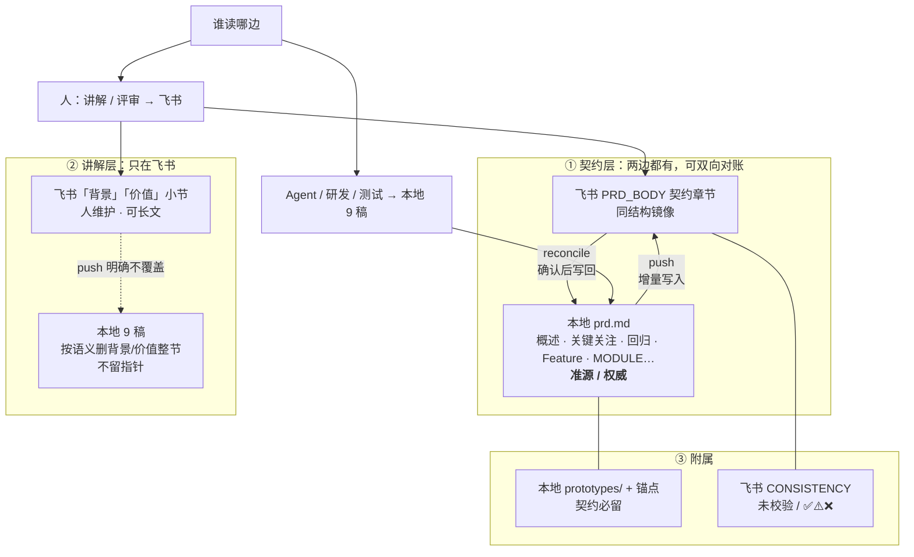
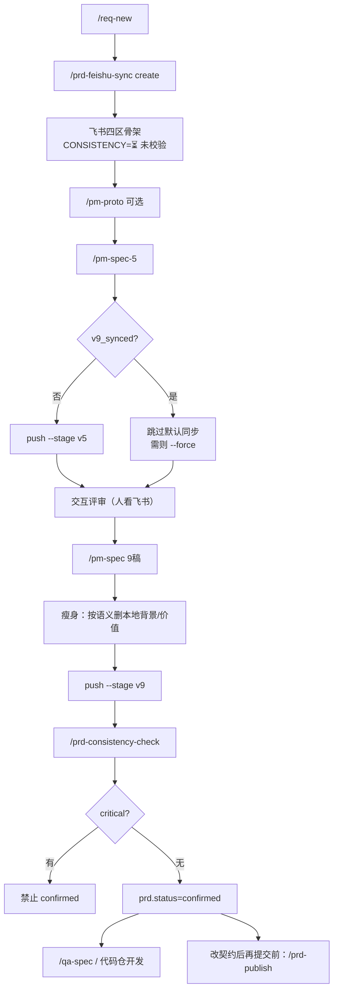
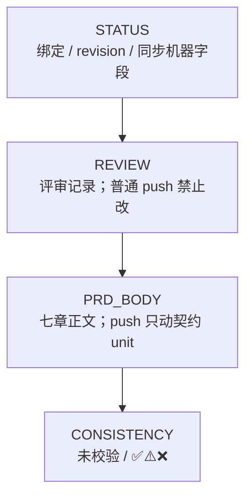
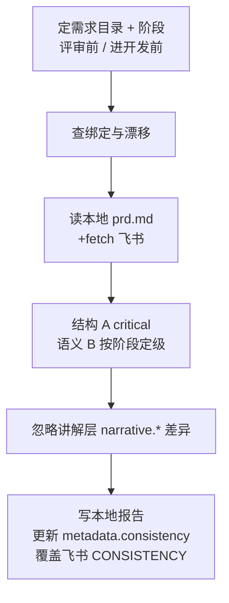
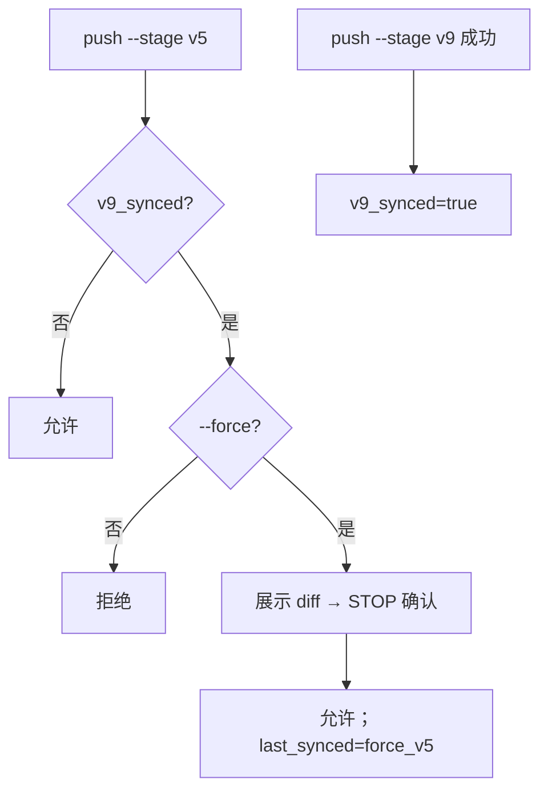

# 工作区 PRD ↔ 飞书同步与一致性校验 — 介绍

> 面向产品 / 研发 / 测试：用一页说清「改了什么、怎么用、拦什么、不拦什么」。  
> OpenSpec 变更：`add-workspace-prd-feishu-sync` · 插件：`workspace-specflow`

## 1. 一句话

**本地 9 稿 `prd.md` 是 Agent 契约准源；飞书是人读讲解/评审面；用同步技能增量对齐契约层，用一致性校验给出可见结论（含「未校验」占位）。**

## 2. 为什么要做

| 痛点 | 本期做法 |
|---|---|
| 讲解在飞书、执行在 Git，两边易漂 | 分层：讲解飞书独占；契约层双向可对账 |
| 整篇覆盖飞书丢评论/排版 | 禁止默认 overwrite；MODULE 行级增量 |
| 不知道有没有对过账 | 飞书 CONSISTENCY 区：未跑显示「⏳ 未校验」，跑完覆盖 ✅/⚠️/❌ |
| 5 稿与 9 稿互相覆盖 | `v9_synced` 后门控，默认不再推 5 稿 |

## 3. 双文档角色

核心就三句话：

1. **人看飞书**（讲解 + 评审）；**Agent / 开发 / 测试读本地 9 稿**。  
2. **只有契约层**在两边对齐（push / reconcile）。  
3. **讲解层只活在飞书**；push 不会用本地空内容把它冲掉。

**定位规则**：`sync unit key` + 标题关键词为主，展示序号只作兼容（见 `prd-feishu-sync/references/chapter-map.md`）。

| 层 | 飞书 | 本地 9 稿 | 同步？ |
|---|---|---|---|
| 讲解（背景 / 价值） | **独占维护** | **整节删除**，不留指针 | **否**（push 不碰） |
| 契约（概述、版本、关键关注、回归、Feature、MODULE…） | 镜像 | **权威准源** | **是**（push / reconcile） |
| 原型 | 链接说明 | `prototypes/` + 锚点必留 | 路径/锚点随契约 |
| 展示序号 | 随产品模板 | **不重排**（不为补洞改号） | unit key 对齐 |

## 4. 新命令一览

| 命令 | 做什么 | 不做 |
|---|---|---|
| `/prd-feishu-sync` | create / push / reconcile / status / rebind | 不给「可开工」结论 |
| `/prd-consistency-check` | 契约层结构 A + 语义 B；落盘报告；写飞书结论 | 不推送正文 |
| `/prd-publish` | 编排 sync → check | 不重复实现同步细节 |

已删除：`/dev-start`（开发在代码仓直接读 confirmed `prd.md`）。

## 5. 主流程

一键路径：任意阶段可用 `/prd-publish`（先 sync 再 check；sync 失败则不跑 check）。

## 6. 飞书文档四区

| 区 | create | push | check |
|---|---|---|---|
| STATUS | 初始化 | 可更新同步字段 | 不改 |
| REVIEW | 空壳 | **禁止** | 不改 |
| PRD_BODY | 七章骨架 | 契约增量；**不覆盖**已有 `narrative.*` | 不改 |
| CONSISTENCY | **⏳ 未校验** | **禁止改写** | **覆盖**结论 |

## 7. 一致性校验怎么跑

**Critical 示例**：无绑定、章节/MODULE 不对齐、MODULE 缺验收/原型说明、9 稿讲解回流、进开发前意图不一致、T4 未推送契约改动。  
**Warning 示例**：评审前语义差、飞书连续正文 >6 行、revision 漂移、讲解仍占位。

## 8. 5/9 同步门控

## 9. 门禁能拦什么（诚实边界）

| 卡点 | 能否拦住 | 机制 |
|---|---|---|
| `/pm-spec` confirmed | ✅ 能（走命令时） | check 有 critical → 不得 confirmed |
| `/qa-spec` 启动 | ✅ 能（走命令时） | `consistency.status=fail` 默认停 |
| `/prd-publish` | ✅ 能 | sync 失败不跑 check；critical → 失败 |
| 飞书是否「未校验」可见 | ✅ 能 | create 即占位；check 后覆盖 |
| 裸 `git commit` 绕过命令 | ❌ **本期不能硬拦** | **无 git hook**；靠 Agent/人自觉先 `/prd-publish` |
| 手改 metadata 伪造 pass | ❌ 不能 | 无服务端鉴权 |

> 设计目标里的「提交前门禁」= **Agent 规程门禁**；husky/pre-commit 列为后续选项（见 design Open Questions）。

## 10. 可读性约束（防大段文字）

- **push**：契约连续正文 >6 行须拆成列表/表/callout，或阻断先改本地  
- **9 稿 AI Review**：大段文字可 P0  
- **check W2**：飞书 >6 行 → warning（默认不单独 hard fail）

## 11. 典型用法（PM）

1. `/req-new` → 自动 create，打开飞书应见「⏳ 未校验」  
2. `/pm-spec-5` → 未 v9 时可 push v5；人在飞书写讲解  
3. 交互评审后 `/pm-spec` → 瘦身 → push v9 → check → confirmed  
4. 以后改契约：`/prd-publish`（或分步 sync + check）  
5. 只改飞书讲解：不必改本地；只改飞书契约：`reconcile` 确认后再写 md  

## 12. 验收对照

- [ ] create 后有 `doc_token`，飞书有 CONSISTENCY「未校验」  
- [ ] v5 可多次增量；讲解不被清空  
- [ ] v9 后本地无讲解层（背景/价值）实质正文、契约展示序号不重排、`v9_synced=true`  
- [ ] 无 `--force` 时 v5 被拒  
- [ ] check 后飞书结论变为 ✅/⚠️/❌，不再显示未校验  
- [ ] `/prd-publish` 一次完成 sync+check  

真机试点见 `tasks.md` Task 9 / `plan.md` Task 9。

## 13. 相关链接

- 飞书项目：https://project.feishu.cn/ruxiao/tec_prd/detail/7016921222  
- 技能：`plugins/workspace-specflow/skills/prd-feishu-sync/SKILL.md`  
- 技能：`plugins/workspace-specflow/skills/prd-consistency-check/SKILL.md`  
- 技能：`plugins/workspace-specflow/skills/prd-publish/SKILL.md`  
- 设计：`design.md` · 提案：`proposal.md` · 任务：`tasks.md`
