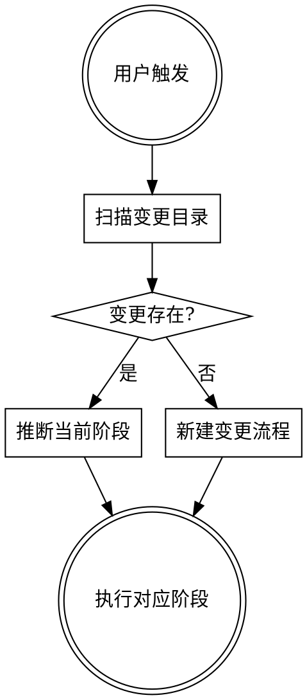

# 后端需求研发工作流编排

Superpowers + OpenSpec 融合的后端全生命周期编排器：根据变更目录中的**文件产物**推断阶段、执行对应链路（设计探索 → 任务规划 → T1 开发 → 可选的前端契约/测试 spec 事件 → 交叉验证 → **Code Review** → 归档）。**OpenSpec + Superpowers 的强制纪律全文见下文「OpenSpec + Superpowers 强制纪律」**；编排分支与纪律阶段编号见**「编号约定：纪律阶段 vs 编排步骤」**。

---

## OpenSpec + Superpowers 强制纪律（嵌入本技能，随插件分发）

以下为后端工作流中与 OpenSpec、Superpowers 相关的**强制纪律**正文；与本技能后半部分「编排顺序与触发语」共同构成完整说明。

### 前置条件检查（必须在阶段 1 之前）

#### 0.1 OpenSpec CLI

> **⚠️** `openspec` 在 Agent 的非交互式 Shell 中可能 **exit=1**、无输出、不创建目录。**根本解法**：所有 `openspec` 命令（`new change`、`instructions`、`validate`、`archive`、`/opsx-new`、`/opsx-continue` 等）**一律由用户在终端执行**。Agent 负责制品**文件内容**与格式正确性。Agent 可用 Shell **仅**执行 `which openspec`（判断是否安装）。

- **已安装（标准模式）**：告知用户在终端执行 `/opsx-new <change-id>` 或 `openspec new change "<change-id>"`；用户将 `openspec instructions … --json` 输出**粘贴**给 Agent；`validate` / `archive` 同理由用户执行。
- **未安装（降级模式）**：明确告知用户；`new change` → `mkdir -p openspec/changes/<change-id>/`；`instructions` → 按本技能与 **`design-to-opsx`** 的制品格式手写；`validate` → 人工检查；`archive` → 在对话中声明完成。**不得跳过实质步骤**。

#### 0.2 Superpowers Skills 与提交前审查（aicr-local）

- **提交前审查（非 Superpowers 内置插件）**：**aicr-local**（`/cr`）与 **`dev-workflow`** 内「两类审查」「Git commit」**并列**落实；负责**每次 commit 前**的暂存区审查，**不**与下方 Superpowers 技能混用或互相替代。
- **应能 Read**（路径可通过 Glob `**/superpowers/**/…/SKILL.md` 定位）：`brainstorming`、`test-driven-development`、`verification-before-completion`、`requesting-code-review`；收到 **MR/合并前评审意见**需结构化处理时，可读 **`receiving-code-review`**。
- **可读取**：对应阶段 Read 后遵循其流程。
- **不可读取（降级）**：brainstorming → 按本技能阶段 1 描述手动；TDD → RED/GREEN/REFACTOR；verification → 直接跑编译/测试/lint 并记录；合并前 code review → 手动七维度评审；**提交前**仍须 **aicr 或自审暂存区**。**不得跳过实质内容**。

### 阶段 1：Brainstorming（与设计探索对齐）

**Skill**：`superpowers:brainstorming`。产出写入 **OpenSpec change 目录**，不写到 `docs/plans/`。

- 探索上下文：`NO_COLOR=1 openspec list` 仅用户终端；Agent 用代码/git 检查；**change-id**：kebab-case、动词开头。
- 澄清 → 2～3 方案 → **【卡点】用户确认方案**前不得进入下一阶段。
- **创建目录**：用户 `openspec new change "<change-id>"` 或降级 `mkdir`。
- **必须**包含 **`design.md`、`plan.md`**（模板与写入职责见 **`design-to-opsx`**）。

### 阶段 2：OpenSpec Artifacts

- **标准模式**：用户 `openspec status` / `openspec instructions <artifact-id> --change "<change-id>" --json`，Agent 按 JSON 的 `template`、`context`、`rules` 填写；**勿**把 `context`/`rules` 复制进制品正文。
- **降级模式**：手写 `proposal.md`、`specs/<capability>/spec.md`（`## ADDED Requirements` + `### Requirement` + `#### Scenario:`）、`tasks.md`（含 TDD `- [ ]`）。
- **验证格式**：用户 `openspec validate "<change-id>" --strict`；常见错误：spec 须在 `specs/<capability>/spec.md`；须有 `## ADDED/MODIFIED/… Requirements`；每 Requirement 至少一个 `#### Scenario:`。

#### 【强制卡点 🚨】2.3 等待用户确认 OpenSpec 制品

**不可**因 session 摘要、「继续」指令隐式通过。进入**阶段 3（实现）**前须完成制品确认；因 **`tasks.md` 多在编排「任务规划」中晚于 `proposal`/`spec` 生成**，本卡点允许**两轮确认**（若团队一次性生成 `tasks.md`，可**合并为一轮**）：

**第一轮**（**`design-to-opsx` 落盘后**，常见状态为已有 `proposal.md`、`specs/**`、`design.md`、`plan.md`，**尚无** `tasks.md`）：

1. `ls` + Read：`proposal.md`、`specs/*/spec.md`、`design.md`、`plan.md`
2. 向用户展示：proposal 核心、Requirements 列表、设计要点；**不**要求此时已存在 `tasks.md`
3. **明确等待**用户确认后，再进入编排「任务规划」以创建 `tasks.md`

**第二轮**（**`tasks.md` 已存在**）：

1. `ls` + Read：`tasks.md`（并视需要回顾 `proposal`/`spec`）
2. 向用户展示：**tasks 列表**与 TDD 分层约定
3. **明确等待**用户确认后再进入阶段 3（实现）

恢复会话时若阶段 3 未开始，须**重新展示**并等待确认（若缺 `tasks.md`，从第一轮或任务规划继续，不得跳过展示）。

### 阶段 3：实现（TDD）

**Skill**：`superpowers:test-driven-development`。

- **标准模式**：用户 `openspec instructions apply --change "<change-id>" --json`；**降级**：读 `tasks.md` 顺序执行。
- **每个 task**：RED（测试失败）→ GREEN（最小实现通过）→ REFACTOR（仍通过）→ 更新 `tasks.md` `[x]`。默认以 **`go test`** 为 RED/GREEN 探针；**非 Go 栈**时用项目等价单测命令。缺测试基础设施时记入 `design.md` 风险。

### 阶段 4：验证

**Skill**：`superpowers:verification-before-completion`。**铁律**：未实际运行命令并看到输出，**不得**声称通过。

- **非 Go 栈仓库**：将下列 `go build` / `go test` 替换为团队约定的编译与测试命令（如 `mvn test`、`cargo test`、`gradle test` 等）；Lint 亦用项目等价物。
- `go build ./...`（或 `make build`）
- `go test ./... -cover`
- Lint：`ReadLints` 或 `make lint`
- **Spec 覆盖**：Read `specs/<capability>/spec.md`，逐条 Scenario 对照实现
- **tasks**：用户 `openspec status` 或 Read `tasks.md` 统计 `[x]`

### 阶段 5：Code Review（Superpowers：合并就绪审查）

**Skill**：`superpowers:requesting-code-review`。`git merge-base` + `git diff`；Task 派发 `code-reviewer`，附带 proposal、spec、BASE/HEAD。**CRITICAL** → 修后回阶段 4；**IMPORTANT** → 修后继续；**SUGGESTION** → 记入 `design.md` Open Questions。

**收到评审意见 / MR 评论时**：优先 Read **`superpowers:receiving-code-review`**，在改代码前区分须落实项与可延后项，避免「为表态而改」；落实后再走阶段 4 验证。

本节针对**分支相对合并基线**的合并前审查，与下文「**两类审查**」中的 **commit 前（aicr-local）** 职责不同，**互不替代、不冲突**。

### 两类审查：提交前（aicr-local）与合并前（Superpowers）

| 时机 | 机制 | 关注点 |
|------|------|--------|
| **每次 `git commit` 前**（用户已同意提交） | **aicr-local**：优先 **`/cr`**（按该技能流程）；否则 Agent **自审暂存区** | 团队规范、业务/变更 spec、**本次提交**的增量与风险 |
| **合并 / 提测 / 归档前**（纪律阶段 5） | **`superpowers:requesting-code-review`** | 相对 BASE 的 diff、与 `proposal` / `specs/**` / `design.md` 的一致性、合并就绪度 |

- **互补**：开发过程中**每一次**准备落库的提交，都须走 **Git commit** 小节中的**提交前审查**（aicr 或自审）；**整个变更**在宣称可合并/可归档前，还须完成本节 **Superpowers** 的纪律阶段 5。
- **不冲突**：先对暂存区做 `/cr` 或自审，再 `commit`，与之后在 MR/合并前跑 `requesting-code-review` 是**同一流水线中的两层门禁**。
- **无 aicr**：仍须在 commit 前做**自审暂存区**；**不得**用「等合并前再 Superpowers CR」跳过提交前审查。

### 阶段 6：收尾与归档

- 确认目录与 `tasks.md` 全 `[x]`；用户 `openspec validate --strict`（降级则人工检查）。
- 用户 `openspec archive "<change-id>" --yes`（降级则对话声明保留目录）。
- **Git**：T1 与事件驱动过程中的 **`git commit` / `push`** 按 **「Git commit」** 与团队规范；**归档后**收尾推送亦按团队流程（勿将「仅收尾 push」误解为唯一提交点）。

### 产出物归属（单 change 单目录）

```
openspec/changes/<change-id>/
  proposal.md
  design.md
  plan.md
  specs/<capability>/spec.md
  tasks.md
```

不在 `docs/plans/` 额外输出设计文档。

### 护栏（不可跳过）

- 不跳过 Brainstorming（含简单任务）。
- **最高优先级**：阶段 **2.3** 制品人工确认——不得因摘要跳过、不得以「继续」代替确认。
- 用户确认制品前**不写**实现代码。
- 不跳过 TDD（禁止先实现后补测）。
- 未跑验证命令**不得**声称完成。
- 不跳过 **纪律阶段 5**（Superpowers Code Review）；**每次 commit 前**不跳过 **aicr-local `/cr` 或自审**（见「两类审查」与「Git commit」）。
- 想跳过护栏时**须询问用户**是否允许。

### 可协商跳过 / 不可跳过

- 可协商：候选方案讨论（若用户已指定方案）；其它以 Superpowers 可选说明为准。
- **不可跳过**：2.3 制品确认；阶段 4 编译/Lint 类验证（即使用户要求也须提示风险）。

### 与原生工具的关系

不修改 Superpowers/OpenSpec 源码；仅定义调用顺序与产出归属。

### 编号约定：纪律阶段 vs 编排步骤

- **纪律阶段**：仅指上文「OpenSpec + Superpowers 强制纪律」中的**阶段 1～6**（制品确认、TDD、验证、Code Review、归档等）。**阶段 5（Code Review）不可跳过**，除非用户**明确同意**跳过并承担风险（仍须在对话或 `design.md` 中留痕）。
- **编排步骤**：下文「根据产物 + 意图推断」表中的**执行分支**（如「编排：交叉验证」）**不是**纪律阶段的同义编号；同一次「可合并/可归档」闭环中，须**先**满足纪律 **4（验证）** 与 **5（Code Review）**，再进入纪律 **6（`openspec archive`）**。`e2e-verify` 产生的报告常作为提测/归档前的**证据链**之一，**不**代替 Code Review。
- **合并前最低顺序**（可与多轮对话交错，但不得缺项）：纪律 4 → 纪律 5 →（报告与门禁满足后）编排「归档」→ 纪律 6。

---

## 启动流程



### 步骤 1：定位目标变更

```bash
find openspec/changes -maxdepth 2 -name proposal.md 2>/dev/null
```

| 场景 | 处理方式 |
|------|---------|
| 无变更目录 | 进入「阶段 1：设计探索」 |
| 仅 1 个变更目录 | 自动选定该变更 |
| 多个变更目录 | 列出所有 change-id，请用户选择 |
| 用户在触发语中指定了 change-id | 直接使用指定的变更 |

### 步骤 2：根据产物 + 意图推断阶段

| 变更目录产物 | 用户意图（触发语示例） | 执行动作 |
|-------------|----------------------|---------|
| 无 | 开始新需求 / 新功能 / 做个新 feature / 开始开发 | 编排：设计探索（纪律 1～2 落盘前） |
| 有 `proposal.md` + `specs/` 但无 `tasks.md` | 继续这个需求 / 接着做 / 继续开发 | 编排：任务规划（纪律 2） |
| 有 `tasks.md` 且存在未勾选项 | 继续开发 / 接着写 / 继续这个需求 | 编排：T1 后端开发（纪律 3） |
| `tasks.md` 全部勾选 | 继续开发 / 接着做（**无**新契约链接、未说跑验收） | **先澄清**：若范围扩大需新任务 → 回到编排「任务规划」增补 `tasks.md` 再继续 T1；若仅收尾/验收 → 引导 **纪律 4～5** 或 **编排：交叉验证** |
| `tasks.md` 全部勾选 | 前端契约到了 / 前端 spec 到了 / 前端 OpenAPI 来了 / 对齐前端接口 | 事件 A：前端契约 → 对齐 |
| `tasks.md` 全部勾选 | 测试 spec 到了 / 测试用例来了 / QA 文档到了 | 事件 B：测试 Spec 到达 |
| `tasks.md` 全部勾选 | 跑自动化验证 / 跑集成测试 / 契约测试 / 跑验收 | 编排：交叉验证（`e2e-verify`） |
| 无活跃变更目录 | 用这个 spec 跑验收 `<链接/路径>` | 编排：交叉验证（延迟模式） |
| 验证与报告已满足团队门禁 | Code Review / 提测前审查 / 走 CR（合并前） | **纪律 5**：`requesting-code-review`（与 **commit 前 aicr `/cr`** 互补，见「两类审查」） |
| 有 `e2e-report.md`（或 `verify-report.md`）且门禁通过 | 归档 / 可以归档了 / archive | **先**确认纪律 **5** 已完成（或用户明确同意跳过）；再 **编排：归档** → 纪律 **6**（用户终端 `openspec archive`） |

> **命名说明**：后端仓库验证报告可使用 `verify-report.md` 或与团队约定沿用 `e2e-report.md`；以变更目录内**可追溯**的结论为准。**纪律阶段 4（验证）**可在 T1 尾声、交叉验证前分多次执行；**纪律阶段 5** 须在宣称合并/归档前落实，见上文「编号约定」与下文「实现与合并门禁」。

---

## 阶段 1：设计探索

### 步骤 1a：扫描当前仓库

在进入需求对齐前，先对当前仓库做一次全局扫描，建立工程上下文：

1. 扫描项目目录结构（`cmd/`、`internal/`、`api/`、`pkg/`、`proto/`、`configs/` 等）
2. 识别技术栈：语言与框架（如 Go + Kratos/Gin）、ORM、消息队列、存储、配置方式
3. 了解分层：handler / service / repo / domain 边界与现有公共库
4. 检查已有的 `openspec/changes/` 目录，了解历史变更上下文

扫描结论作为后续 brainstorming 和任务规划的**工程约束**输入。

### 步骤 1b：采集与结构化产品需求

目标：得到**完整、可评审**的需求表述，再进入 brainstorming。**输入形式多样**，需统一抽取为「需求事实 + 范围边界」。

#### 飞书文档链接

若用户提供了**飞书文档链接**：

1. 使用 **`feishu-mcp`**（或工作区已启用的等价飞书文档 MCP）拉取文档正文。
2. **失败时须向用户给出明确提示**（不要静默跳过）：未安装 MCP、鉴权失败、权限不足时说明原因，并给出可行替代（例如请用户粘贴正文、导出文件后再贴入对话）。
3. 范围限定（自然语言范围、截图）仅将约定范围纳入本次变更必选范围。

#### GitLab 上的 Spec / 需求文档（尚无变更目录时）

若用户给出 **GitLab 文件或仓库内文档 URL** 作为需求来源，且当前**还没有** `openspec/changes/<change-id>/`：

1. **不得**调用 **`pull-spec` 写入**变更目录（`pull-spec` 要求目标目录已存在且含 `proposal.md`）。
2. 使用 **`GITLAB_TOKEN`** 经 GitLab API / Raw 拉取正文，或由用户**粘贴**全文到对话；将内容并入「需求事实 + 范围边界」。
3. 用户 **`/be-sdd` 放行**并由用户在终端执行 `openspec new change`（或降级 `mkdir`）**之后**，再按 **`design-to-opsx`** 落盘；此前采集的 GitLab 正文仅存在于对话上下文。

已有变更目录后，若需把外部契约**落盘**到 `frontend-*.md` / `qa-*.md`，使用 **`pull-spec`**。

#### 本地文件与其它来源

- **工作区或用户 @ 的路径**：Read 相关文件，纳入需求事实；不得遗漏用户点名的文件。
- **无飞书、无 GitLab 时**：纯文字、截图、截图+文字**同样有效**；信息不足时在 brainstorming 中**主动追问澄清**。

#### 与 brainstorming 的衔接

多源输入须**逐源采集**后合并为单一需求事实，再进入 **步骤 1d `superpowers:brainstorming`**，完成澄清、方案对齐与确认，再落盘 OpenSpec。

### 步骤 1c：读取 API/契约设计输入（如有）

**后端不以 Figma 为 UI 权威来源。** 若存在下列输入，应读取并作为**对外契约与分层设计**的约束：

- **OpenAPI / Swagger**、**Apifox/APIFox** 导出链接或文件
- **Protobuf**、**gRPC** 定义（`.proto`）
- 团队约定下的 **GraphQL schema** 等

若与后续「前端契约」冲突，以**联调前对齐**为准，并在 `proposal.md` 的 **Decisions** 中记录差异处理。

### 步骤 1d：Brainstorming

**REQUIRED SUB-SKILL:** Use `superpowers:brainstorming`

遵循 brainstorming 全流程，**增加以下后端约束**：

1. 以仓库扫描结论为**工程约束**（分层、技术栈、模块边界）
2. 以步骤 1b 的需求与步骤 1c 的契约为输入；明确 **SLA、幂等、事务边界、错误码、分页、兼容性** 等是否在本次需求范围内
3. 方案聚焦**后端实现**：分层职责、领域模型、存储与迁移、对外 API 形态
4. 产出**服务端视角的 API 契约**（路径/方法或 RPC、请求/响应字段、错误码、分页约定）——供前端与联调对齐；与上文**强制纪律**阶段 1 要求的 **design.md / plan.md** 一致（模板见 **`design-to-opsx`**）
5. 设计确认后，**不**调用 `superpowers:writing-plans`（由 **`design-to-opsx`** + `tasks.md` 承接；**plan.md** 模板见 **`design-to-opsx`**）
6. 设计确认后，进入 **步骤 1e 后端灰区讨论**

### 步骤 1e：后端灰区讨论

Brainstorming 确认方案后、调用 `design-to-opsx` 前，识别本次变更中**尚未明确的实现细节**（灰区），逐维度向用户提问并收集决策。

#### 灰区维度清单

仅讨论与本次变更**相关**的维度，跳过不涉及的部分。

**1. API 与兼容性**
- 版本策略：URL 版本 / Header / proto package？
- 向后兼容：是否允许 breaking change？弃用周期？
- 错误模型：HTTP 状态码、业务错误码、国际化字段？

**2. 数据与一致性**
- 事务边界：单库事务 / 分布式事务 / Saga？强一致还是最终一致？
- 幂等与重试：哪些接口须幂等键？去重存储策略？
- 迁移：是否需要 DB migration？可逆性？

**3. 安全与权限**
- 鉴权方式：JWT、Session、mTLS？
- 鉴权粒度：RBAC、ABAC？资源级校验点？

**4. 性能与容量**
- 分页/游标默认值？最大 page size？
- 热点与限流：是否需要限流、熔断？

**5. 可观测性**
- 日志字段、trace id、指标与告警是否纳入本次？

**6. 与前端契约的对接**
- 字段命名、时间格式、空值语义、枚举与前端是否已对齐？

#### 讨论方式

1. Agent 基于 brainstorming 方案，**自动识别**本次变更涉及哪些灰区维度（通常 2–4 个）
2. 提出**具体的、带选项的**问题；用户可答「用项目默认」，Agent 依据步骤 1a 扫描推断
3. 决策汇总后写入 `proposal.md` 的 **Decisions** 与 **后端实现决策（灰区）**（见 `design-to-opsx`）

#### 跳过条件

- 纯配置/文档微调，无接口与数据行为变更
- 用户明确表示「跳过灰区讨论」

灰区讨论完成后，**调用 `design-to-opsx`** 落盘 OpenSpec，并补充 **`design.md`、`plan.md`**（见上文**强制纪律**阶段 1 与 **`design-to-opsx`**）。

## 阶段 2：任务规划

基于 `proposal.md` 和 `specs/*/spec.md` 创建 `tasks.md`。

**tasks.md 格式**：使用以下头部模板，后接具体 task 列表：

```markdown
# Tasks: <change-id>

> **执行约束**
> - 每个 task 遵循 TDD: 写测试 → 验证失败 → 最小实现 → 验证通过
> - 完成有意义的 task 后 commit（**须用户确认**；确认后 `git add .` → **必须**提交前审查 **aicr-local**（`/cr`）或 Agent 自审暂存区 → 再 commit；与 Superpowers **合并前 CR** 互补，见**强制纪律**「两类审查」与「Git commit」），不要求每个 TDD 循环都 commit
>
> **测试分层（后端）**
> - L1 单元测试: 纯逻辑、domain、无 IO 或全 mock（`go test ./pkg/...`）
> - L2 集成测试: handler/service + 测试库/容器（按项目约定）
> - L3 联调: 前端契约到达 → 校准契约；真实依赖联调
> - L4 交叉验证: 测试 spec 到达 → 契约/集成/（可选）端到端场景，见 `e2e-verify`

## 1. <功能模块>

- [ ] 1.1 <任务描述>（文件: `path/to/file.go`）
      测试要点: <该 task 的 TDD 验证点>
```

**后端 task 粒度**：按分层与包拆分（service、repo、handler、迁移任务等），每个 task 聚焦一个可测试交付物。

**openspec CLI**：提示用户在终端执行 `/opsx-continue` 创建 tasks 制品。Agent 负责 tasks.md 内容编写。

**卡点**：展示 tasks 内容，等待用户确认后开始 T1 开发。

## 阶段 3：T1 后端开发

本阶段**先完成开发与 TDD**，再在合适粒度提交。**提交动作**统一见下文「Git commit」。

### 开发与 TDD（主线）

逐 task 执行，遵循 TDD 纪律（写测试 → 验证失败 → 最小实现 → 验证通过）。

- **L1**：对纯逻辑与 domain 写 **单元测试**（`go test`，表驱动优先）
- **L2**：对 HTTP/gRPC handler、与 DB/缓存的集成，按项目约定写 **集成测试**（勿在业务代码中硬编码测试依赖）
- 基于 `specs/*/spec.md` 的 **Scenario** 映射到测试用例名或注释，便于上文**强制纪律**阶段 4「Spec 覆盖验证」对照
- 完成有意义的 task 后，在**用户确认**后按 **Git commit** 提交；联调或后续修复同理
- 每个 task 完成后在 tasks.md 标记 `[x]`

### 实现与合并门禁（对齐上文强制纪律）

在宣称「可合并/可提测」前，须落实**强制纪律**中阶段 4～5 的要求，包括：

- **验证**：`go build ./...`、`go test ./...`（或项目 Makefile）、Lint、**逐条 Scenario 与代码对照**
- **合并前 Code Review（纪律阶段 5）**：`superpowers:requesting-code-review` 或团队等价流程（与**每次 commit 前的 aicr-local** 互补，见上文「两类审查」）

开发过程中**每一次**用户确认的提交，另须遵守下文 **Git commit**（**aicr-local `/cr` 或自审**）。具体命令以项目脚本为准；**不得在未运行验证命令的情况下声称完成**（见 **superpowers:verification-before-completion**）。

### Git commit（需用户确认，可复用）

本节规定 **commit 前**的**本地/团队代码审查**（**aicr-local**），与**强制纪律**「两类审查」及 **Superpowers 纪律阶段 5** 一致：**commit 链**上必须有审查，**合并前**仍须 Superpowers CR。

在**任何**会写入 Git 历史的提交操作之前：

1. **必须先获得用户明确同意**（例如用户表示「可以提交」「确认 commit」「帮我 commit」）。未确认前不执行 `git commit` 或等效操作。
2. 用户同意后，按**固定顺序**执行：
   1. **`git add .`**
   2. **提交前代码审查（必须，aicr-local）**：
      - 若工作区已配置 **aicr-local**：**优先**按该技能执行 **`/cr`**（或文档规定的等价命令），基于**暂存区**与团队规范产出审查结论；有问题先修再提交。
      - **若无** aicr-local：Agent 对**暂存区 diff** 做结构化自审（安全、规范、与 `spec`/任务一致性），**不得**省略。
      - **不**将本步与 Superpowers **`requesting-code-review`** 混为一谈：前者针对**即将进入本次 commit 的增量**，后者针对**整分支合并就绪**（见纪律阶段 5）。
   3. **提交**：审查通过后，优先项目 commit Command，否则终端 `git commit`。
3. 若用户拒绝或暂不提交，只保留工作区改动说明，不擅自执行 `git add` / `/cr` / `git commit`。

---

## 事件驱动阶段（T1 后）

T1 完成（tasks.md 全部 `[x]`）后，根据用户触发语执行对应链路。以下事件均为**可选**。

### 事件 A：前端契约到达 → 对齐

**触发语示例**：
- "前端契约到了 `<GitLab链接>`"
- "前端 OpenAPI 来了 `<链接>`"
- "对齐前端接口 `<链接>`"

**REQUIRED SUB-SKILL:** Use `pull-spec`

1. 定位当前变更目录 → 拉取前端契约或共享 OpenAPI，写入 `openspec/changes/<change-id>/frontend-*.md`（或团队约定文件名，与 `proposal.md` 同级）
2. 对比 **服务端已实现 API** 与前端契约差异
3. 调整 handler/DTO/错误码 → **全量重跑**相关 `go test`
4. 全部通过 → 对齐完成；若需提交，**沿用阶段 3「Git commit」**

### 事件 B：测试 Spec 到达

**触发语示例**：
- "测试spec到了 `<GitLab链接>`"
- "测试用例来了 `<链接>`"
- "QA文档到了 `<链接>`"

**REQUIRED SUB-SKILL:** Use `pull-spec`

1. 定位当前变更目录 → 拉取测试 spec 写入 `openspec/changes/<change-id>/qa-*.md`
2. 对比 `specs/*/spec.md` 与已有测试，标记增量/盲区（为 **e2e-verify** 与补充测试提供依据）
3. **可选衔接**：解析 `qa-*.md` 后，可询问用户是否**立即进入**编排「交叉验证（`e2e-verify`）」；**仅当用户明确同意**后再进入（不得自动跑全量集成测试）

**目录规范**：外部拉取的 spec 与 `proposal.md` 同级，落在 **`openspec/changes/<change-id>/`**；与上文**强制纪律**「产出物归属」一致，便于与前端或其它仓库按**同一 `change-id`** 对齐变更范围。

---

## 编排：交叉验证（`e2e-verify`）

（**编排**名；**纪律阶段 4** 的编译/测试/Scenario 对照须已落实或在本阶段一并收口；报告通过后进入 **纪律阶段 5**。）

### 触发方式

1. **用户主动命令**：「跑自动化验证 / 跑集成测试 / 契约测试 / 跑验收」等 → 进入 `e2e-verify`（后端语义见该技能）。
2. **测试 spec 到达后的提示**：在**事件 B** 后，可询问是否马上验证；**用户确认后**再进入。

**REQUIRED SUB-SKILL:** Use `e2e-verify`

### 验证顺序与 spec 置信度

1. **TDD 优先**：进入本阶段前，**先**尽量跑通 `go test` / 项目测试脚本；若项目未配置测试，在报告中如实说明。
2. **多份 spec 对照**：综合阅读 **`qa-*.md`**、`specs/*/spec.md`、`frontend-*.md`（如有）、`backend-*.md`（如有，来自其它团队）。**置信度优先级**：**测试 spec 最高**，其次为前后端 spec 与契约。
3. **实现与测试 spec 不一致**：须在验证报告中**显著标明**（见 `e2e-verify` 模板）。

### 模式说明

- **常规模式**：从变更目录读取 spec；有 `qa-*.md` 以其为主。
- **延迟模式**：用户手动指定 spec 来源（文件路径 / GitLab 链接 / 粘贴内容）。

输出报告 → 修复失败项 → 全部通过后，**先**完成 **纪律阶段 5（Code Review）**，再进入下文「编排：归档」。

## 编排：归档（纪律阶段 6）

**前置**：`tasks.md` 全 `[x]`、`openspec validate`（用户终端）通过、验证报告满足团队门禁，且 **纪律阶段 5** 已完成（或用户书面同意跳过并留痕）。

提示用户在终端执行：

```bash
openspec archive "<change-id>" --yes
```

归档完成后，变更目录（含 `frontend-*.md`、`qa-*.md` 等外部 spec）整体归档。

---

## 护栏

- 不跳过阶段 1 的 brainstorming（即使任务看起来简单）
- 不在用户确认 tasks 前开始写实现代码
- 不跳过 TDD 循环（不允许先实现再补测试）
- 不在没有运行验证命令的情况下声称完成
- openspec CLI 命令一律由用户在终端执行（见上文**强制纪律** 0.1）
- 不得在用户未明确同意时执行 `git commit` 或等效写入 Git 历史的操作
- **结构关系**：本技能**编排顺序与触发语**与推断表为一整块；**OpenSpec 制品结构、design/plan、验证与 Code Review 的强制顺序**以本文**「OpenSpec + Superpowers 强制纪律」**及**「编号约定：纪律阶段 vs 编排步骤」**为准；若编排段落与强制纪律冲突，以**强制纪律**为准
