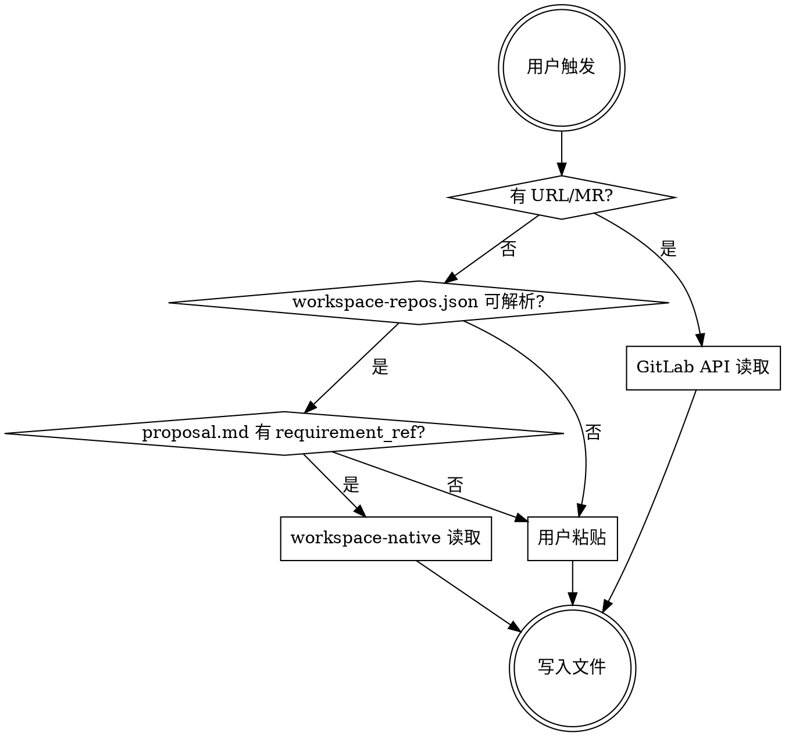

# 拉取外部 Spec（后端仓库 · workspace-aware）

从工作区本地仓库或 GitLab 拉取**前端契约**、**其它团队的后端 spec 片段**或**测试/QA spec**到当前 OpenSpec 变更目录：先定位 `change-id` → 自动选择最优读取策略 → 按命名写入 `openspec/changes/<change-id>/` → 执行后端视角差异分析。

## 与「仅有 GitLab 需求、尚无变更目录」的区别

- **需求探索阶段**（尚无 `openspec/changes/<change-id>/`）：用 **`GITLAB_TOKEN`**（或 **`GITLAB_PRIVATE_TOKEN`**）**+ API** 或用户粘贴，在对话中完成需求事实；**不要**调用本技能写入（见 **`dev-workflow`** 步骤 1b）。
- **本技能**：仅在目标目录**已存在**且含 **`proposal.md`** 时，将外部契约/spec **落盘**。

## 三级读取策略

开发者无需关心"我在工作区还是单项目"，`pull-spec` 自动选择最优路径：

| 优先级 | 策略 | 条件 | 体验 |
|--------|------|------|------|
| 1 | **workspace-native** | 工作区可解析 **`workspace-repos.json`**（仓库根或 `scripts/workspace-repos.json`，与 `references/workspace-native.md` 一致）且可达目标仓库 | 零手动输入 |
| 2 | **GitLab API** | 用户提供 URL 或 MR 链接 | 给个链接即可 |
| 3 | **用户粘贴 / @ 工作区文件** | 上述均不可用，或用户 @ 注入正文 | 兜底（与粘贴等价） |

## 前后端与 QA 的复用方式（目录规范一致）

- **团队约定**：**前端仓库**与**后端仓库**针对**同一需求**使用**同一 `change-id`**，外部拉取的文件落在 **`openspec/changes/<change-id>/`**（与 `proposal.md` 同级）。
- **测试/QA spec**：`qa-*.md`；**前端契约**：`frontend-*.md`；**兄弟后端共享 spec**：`backend-*.md`。
- **GitLab 源文件**为共享真相；落地路径在前后端各自仓库中**结构相同**。

## 输入

用户提供以下任一形式（或不提供，由 workspace-native 自动发现）：

1. **无显式输入**（workspace-native 自动发现）：用户仅说"前端 spec 到了"或"测试 spec 到了"
2. **GitLab 文件 URL**
3. **GitLab MR URL**（自动提取 source branch）
4. **直接粘贴内容**（降级）
5. **Cursor @ 工作区文件**（与策略 3 等价）：用户在对话中 **@** 任意已加入多根工作区的 **spec 类文件**（不限仓库：可为 specs 仓库的需求/测试文档，或其它根目录下的 **前端契约、OpenAPI、后端兄弟仓 spec** 等 Markdown/文本）。编辑器将**文件正文注入上下文**，视为已提供 spec 全文并走 **策略 3** 落盘；**不**单独作为 workspace-native（无自动 `git show` 元数据）。多人协作时，应先在**该文件所在仓库** **pull / 切到约定分支**，再 @，避免基于过期副本写入。

**@ 时由 Agent 推断落盘类型（勿写死为某一种文档）**：综合 **用户触发语**、**路径**、**正文结构**及 **当前会话所在代码仓库角色**（本技能多用于后端仓库），自动判断应写入 `qa-*.md`、`frontend-*.md`、`backend-*.md` 等中的哪一类，并选择步骤 5 的差异分析分支；**若无法唯一判断，先列出选项请用户确认再写入**。

## 定位目标变更

拉取前**必须**先确定写入哪个变更目录。

```bash
find openspec/changes -maxdepth 2 -name proposal.md 2>/dev/null
```

| 场景 | 处理方式 |
|------|---------|
| 仅 1 个变更目录 | 自动选定 |
| 多个变更目录 | 列出所有 change-id，请用户选择 |
| 用户触发语中包含 change-id | 直接使用 |
| 无变更目录 | **拒绝执行**，提示用户先完成设计探索（阶段 1）创建变更 |

## 流程

### 步骤 1：判断读取策略



触发语中若含 **@ 文件** 而无 URL，且不满足 workspace-native 条件，则与「用户粘贴」走同一出口。

### 步骤 2：拉取内容

#### 策略 1：workspace-native 读取（零手动输入）

当用户未提供 URL，且工作区内能按 `references/workspace-native.md`「前置检查」解析到 **`workspace-repos.json`（根目录或 `scripts/`）** 且 `proposal.md` 含 `requirement_ref` 时自动触发。

分两种子场景：**A. 测试 spec**（从 specs 仓库读取，**优先 `origin/main`，再 `origin/master`**，均失败则分支发现）、**B. 对方 API spec**（跨仓库 `git fetch` + 分支发现 + `git show`，不 checkout）。任一步骤失败则自动降级到策略 2 或 3。

> **完整 git 命令、分支发现逻辑、MODULE 切片、降级路径**见 `references/workspace-native.md`。

#### 策略 2：GitLab API 读取

当用户提供 GitLab 文件 URL 或 MR URL 时使用。

1. 检查 Token（与 **aicr-local** 一致，二者**任一生效**即可）：
   ```bash
   test -n "${GITLAB_TOKEN:-$GITLAB_PRIVATE_TOKEN}"
   ```
   退出码非 0 → 提示配置 `GITLAB_TOKEN` 或 `GITLAB_PRIVATE_TOKEN`，或粘贴内容。
2. **文件 URL**：解析参数，调用 GitLab API：
   ```bash
   curl -sf --header "PRIVATE-TOKEN: ${GITLAB_TOKEN:-$GITLAB_PRIVATE_TOKEN}" \
     "https://<gitlab-host>/api/v4/projects/<group%2Frepo>/repository/files/<file-path>/raw?ref=<branch>"
   ```
3. **MR URL**：提取 project + MR iid，获取 source branch，再拉取 spec 文件
4. 返回 `403`/`404` → 提示用户检查权限或粘贴内容

#### 策略 3：用户粘贴 / @ 工作区文件（兜底）

当策略 1、2 均不可用时：请用户**直接粘贴** spec 文本；或用户已在消息中 **@** 工作区文件，则使用对话中的文件正文作为 spec 源（**任意仓库、任意相对路径**，见上文「@ 时由 Agent 推断落盘类型」）。

**@ 与粘贴的元数据**（写入步骤 4 文件头）：

- `source`：优先写 `workspace-file@<所在仓库>:<相对路径>` 或 `workspace-file@<相对路径>`；若无法可靠解析路径，写 `"user-paste"`。
- `ref` / `commit`：若 Agent 能在该文件所在仓库执行 `git rev-parse HEAD` 且路径属该仓库，可填当前 HEAD；否则填 `N/A` 并依赖人工确认文档已最新。

### 步骤 3：MODULE 切片（如适用）

`proposal.md` 含 `modules` 字段时，按 MODULE 过滤测试场景（保留公共部分）。无 `modules` 则保留完整内容。详见 `references/workspace-native.md`。

### 步骤 4：写入本地

**命名规范**（按拉取内容类型选择）：

| 类型 | 文件名模式 |
|------|-----------|
| 前端契约 / 前端 OpenAPI / 对齐用说明 | `frontend-<描述性名称>.md` |
| 测试 / QA 验收 spec | `qa-<描述性名称>.md` |
| 其它后端团队共享 spec | `backend-<描述性名称>.md` |

**文件头部**（自动注入）：

```markdown
<!-- pull-spec metadata -->
<!-- source: <GitLab URL / workspace-native / workspace-file@<path> / "user-paste"> -->
<!-- ref: <branch or ref name, 如 refs/remotes/origin/feat/xxx> -->
<!-- commit: <commit hash 或 "N/A"> -->
<!-- pulled_at: <YYYY-MM-DD HH:mm> -->
<!-- WARNING: 此文件为外部 spec 副本，实现以源仓库为准 -->
```

**写入路径**：`openspec/changes/<change-id>/`（与 `proposal.md` 同级）。

**路径约束**：写入前验证目标目录存在 `proposal.md`；写入后 `ls` 确认。

### 步骤 5：差异分析（后端视角）

拉取完成后自动执行：

**若本次写入的是 `frontend-*.md`（前端契约到达）**：

1. 读取 `proposal.md` 中 **API 契约（服务端对外）** 段落
2. 读取 `design.md` / `specs/*/spec.md` 中与接口相关的 Requirements（如有）
3. 读取拉取的前端契约
4. 对比并输出：
   - **一致**：服务端设计与前端契约吻合
   - **差异**：路径、方法、字段、错误码、分页、枚举等
   - **增量**：前端新增字段或场景，后端尚未覆盖
5. 给出**代码与测试**调整建议（handler、DTO、错误映射、`go test` 范围）

**若本次写入的是 `qa-*.md`（测试 spec 到达）**：

1. 读取 `qa-*.md` 中的验收场景
2. 读取 `specs/*/spec.md` 中的 Scenario
3. 标记增量/盲区，供 **`e2e-verify`** 与补充测试使用

**若本次写入的是 `backend-*.md`**：

1. 与当前变更的 `proposal.md`、`specs/*/spec.md` 对照
2. 列出冲突与需统一的口径

## 归档注意

归档时须随变更目录保留所有 `frontend-*.md`、`backend-*.md` 和 `qa-*.md` 文件。
