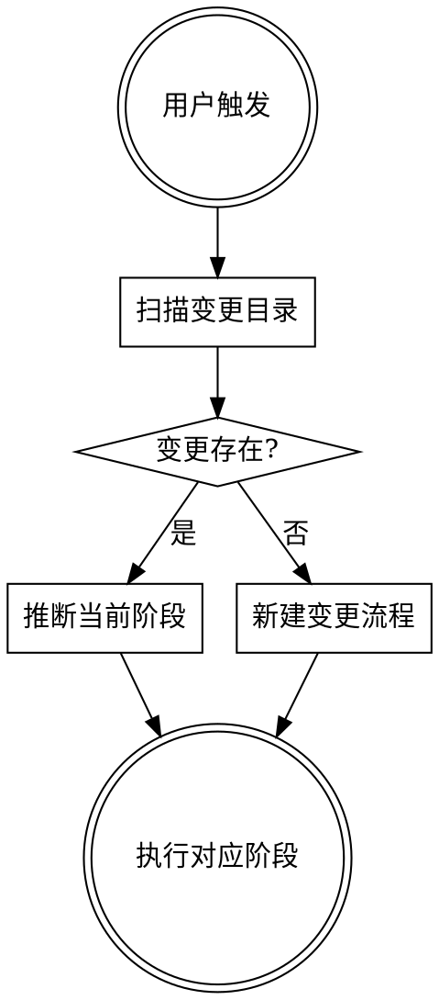

# 前端需求研发工作流编排

Superpowers + OpenSpec 融合的前端全生命周期编排器。根据变更目录中的**文件产物**自动判断阶段、执行对应链路。

## 启动流程



### 步骤 1：定位目标变更

```bash
find openspec/changes -maxdepth 2 -name proposal.md 2>/dev/null
```

| 场景 | 处理方式 |
|------|---------|
| 无变更目录 | 进入「阶段 1：设计探索」 |
| 仅 1 个变更目录 | 自动选定该变更 |
| 多个变更目录 | 列出所有 change-id，请用户选择 |
| 用户在触发语中指定了 change-id | 直接使用指定的变更 |

示例：用户说「跑一下 add-refund-detail 的 e2e」→ 直接定位到 `openspec/changes/add-refund-detail/`。

### 步骤 2：根据产物 + 意图推断阶段

| 变更目录产物 | 用户意图（触发语示例） | 执行动作 |
|-------------|----------------------|---------|
| 无 | 开始新需求 / 新功能 / 做个新 feature / 开始开发 | 阶段 1：设计探索 |
| 有 `proposal.md` + `specs/` 但无 `tasks.md` | 继续这个需求 / 接着做 / 继续开发 | 阶段 2：任务规划 |
| 有 `tasks.md` 且存在未勾选项 | 继续开发 / 接着写 / 继续这个需求 | 阶段 3：继续 T1 开发 |
| `tasks.md` 全部勾选 | 后端 spec 到了 / 后端接口文档来了 / API 文档到了 | 事件 A：后端 Spec → 联调 |
| `tasks.md` 全部勾选 | 测试 spec 到了 / 测试用例来了 / QA 文档到了 | 事件 B：测试 Spec 到达 |
| `tasks.md` 全部勾选 | 跑自动化验证 / 跑 e2e / 浏览器验证一下 / 验证一下这个需求 | 阶段 4：Browser 交叉验证 |
| 无活跃变更目录 | 用这个 spec 跑 e2e `<链接/路径>` / 按这个测试用例验证一下 | 阶段 4：Browser 交叉验证（延迟模式） |
| 有 `e2e-report.md` 且 **`## 验收结论`** 允许归档（**通过**，或**不通过**但已记录用户同意带已知问题归档） | 归档 / 可以归档了 / archive | 阶段 5：归档 |
| 有 `e2e-report.md` 但结论不通过且未同意带债 | 继续修 E2E / 重跑（仍属阶段 4 后续） | 不进入阶段 5 |

---

## 阶段 1：设计探索

### 步骤 1a：扫描当前仓库

在进入需求对齐前，先对当前仓库做一次全局扫描，建立工程上下文：

1. 扫描项目目录结构（`src/`、`components/`、`pages/`、`stores/` 等）
2. 识别技术栈：框架（Vue/React/…）、构建工具、UI 组件库、状态管理方案、路由方案、样式方案
3. 了解现有模块划分、公共组件、工具函数、API 层封装方式
4. 检查已有的 `openspec/changes/` 目录，了解历史变更上下文

扫描结论作为后续 brainstorming 和任务规划的**工程约束**输入——确保方案设计符合现有架构，而非凭空规划。

### 步骤 1b：采集与结构化产品需求（多源、可组合）

目标：得到**完整、可评审**的需求表述，再进入 brainstorming。需求来源可以是**单一渠道**，也可以是**多个组合**（如「飞书链接 + Spec 文档 + 截图补充」），Agent 须按来源逐一采集，最终**合并整理**为统一的「需求事实 + 范围边界」，不得遗漏用户给出的范围限定。

#### 来源一览

| 来源 | 获取方式 | 典型场景 |
|------|----------|----------|
| **飞书文档** | **feishu-mcp**（或等价 MCP）自动拉取 | 产品 PRD / 需求文档在飞书 |
| **Spec 文档（GitLab）** | 复用 **pull-spec** 的 GitLab API 机制（`GITLAB_TOKEN` + API）**读取内容** | 产品/业务需求以 Spec 形式存放在另一个 GitLab 仓库 |
| **截图** | 直接上传 | 原型图、飞书片段截图、标注图 |
| **纯文字** | 对话中输入 | 口头描述、聊天记录、会议纪要 |
| **本地文件** | 文件路径 | 已导出的文档（Markdown / PDF / Word 等） |

> **注意**：上述来源**不互斥**——用户可一次性提供多种来源。Agent 须依次处理每种来源，汇总后再进入 brainstorming。

#### 飞书文档链接

若用户提供了**飞书文档链接**：

1. 使用 **`feishu-mcp`**（或工作区已启用的等价飞书文档 MCP，如 `user-feishu-mcp`）拉取文档正文。
2. **失败时须向用户给出明确提示**（不要静默跳过）：
   - **未安装 / 未启用** feishu-mcp：说明当前无法读取飞书文档，请用户安装并启用 MCP，或改为粘贴需求正文 / 导出为本地文件后再继续。
   - **鉴权失败、token 过期或权限不足**：说明具体现象（401/403、无权限等），请用户更新 token、重新登录飞书集成或调整文档可见范围，或改用粘贴/截图等方式提供需求。

#### Spec 文档（GitLab 仓库）

若用户提供了 **GitLab 文件 URL**（指向产品/业务 Spec，而非后端接口或测试用例）：

1. 复用 **`pull-spec`** 的 GitLab API 机制（`GITLAB_TOKEN` + GitLab REST API）**读取文件内容**。
2. **与 T1 后 pull-spec 的区别**：阶段 1 此时**尚无变更目录**，拉取的内容**仅作为 brainstorming 的输入材料**，**不写入** `openspec/changes/`（变更目录在 `design-to-opsx` 时才创建）。Spec 来源 URL 将记入后续 `proposal.md` 的 `References` 中。
3. **失败处理**：与 pull-spec 一致——`GITLAB_TOKEN` 缺失或无权限时明确提示，降级为用户粘贴内容。

#### 截图 / 纯文字 / 本地文件

若用户提供以下任一形式（可与上述来源**组合**使用），**同样视为有效需求来源**：

- **纯文字描述**（聊天中的需求说明）
- **截图**（需求原型、飞书片段截图、标注图等）
- **截图 + 文字**补充
- **本地文件**（导出的 Markdown / PDF 等）

对上述内容：识别业务目标、功能点、交互与数据要求、验收口径；信息不足时在 brainstorming 中**主动追问澄清**，而不是猜测补全。

#### 范围限定（适用于所有来源）

若用户在提供任何来源时**同时指定了范围**（二选一或并存）：
- **自然语言范围**（如「只做订单列表页的筛选区」「第 3 节到第 5 节」）：只将**该范围**内的需求纳入本次变更的必选范围，并在笔记中写明边界；范围外内容仅作背景，不自动纳入实现范围。
- **截图圈选/标注**：以截图所示区域或标注为准，识别对应模块/模块内控件，同样写明「本次仅覆盖截图/描述所指范围」。

#### 多源合并与冲突

当用户同时提供多种来源时：
1. 按来源逐一采集并提取需求点、业务规则、验收标准。
2. **合并**为统一的结构化需求摘要；标注每条需求的**出处**（飞书 / Spec / 截图 / 文字）。
3. **来源间信息冲突**时：**不自行裁决**，在 brainstorming 中**向用户列出冲突点**并请求澄清。

#### 与 brainstorming 的衔接

无论来自飞书、Spec 文档、截图还是纯文字（或它们的组合），**需求提取完整后**，必须进入 **步骤 1d `superpowers:brainstorming`**，完成需求澄清、方案对齐与确认，再落盘 OpenSpec。

### 步骤 1c：读取设计稿（如有）

**优先使用 Figma MCP**（`user-Figma` MCP）读取设计稿，作为 UI 的**权威参考**。

1. 若用户提供了 Figma 链接或文件/节点信息，用 Figma MCP 获取节点树、布局、组件与**视觉规格**（颜色、字号、字重、行高、间距、圆角等）。
2. **前端样式实现须严格遵守设计稿**中与本次需求相关的规格；brainstorming 与 T1 实现中须反复对照设计稿，避免「凭感觉」偏离。
3. **局部变更 / 指定范围（强约束）**  
   若本次仅修改**某页面中的指定范围**（例如「只改 A 页上的某某模块/区域」，且用户用语言或截图标明了范围）：
   - **优先**在 Figma 中定位并读取**该范围**对应的 Frame/组件变更；实现与样式调整**仅限该范围**。
   - 对**同一页面内、未在需求/设计稿中指明要改动的其它区域**：若设计稿与**当前线上/仓库代码**存在差异，**不得**为「对齐设计稿」而**擅自全页重绘或大范围重构**。
   - 上述情况下必须先**与用户二次确认**（是否顺带改版其余区域、是否只保证本次范围与设计一致）；**禁止**在未确认的情况下自行做全量页面修改。

### 步骤 1d：Brainstorming

**REQUIRED SUB-SKILL:** Use `superpowers:brainstorming`

遵循 brainstorming 全流程（探索上下文 → 逐问澄清 → 2-3 方案 → 逐节确认），**增加以下前端约束**：

1. 以仓库扫描结论为**工程约束**（现有架构、技术栈、模块划分、编码风格）
2. 以步骤 1b 得到的需求（飞书/截图/文字及其**范围边界**）为业务背景；以步骤 1c 的 Figma 规格为 UI 约束；**局部变更时**在方案中明确写出「本次改动边界」与「明确不改动的区域」，避免范围蔓延
3. 方案聚焦**前端实现**：组件拆分、状态管理、路由、样式方案——须复用现有公共组件和工具函数
4. 产出**前端视角的 API 契约**（请求参数、响应结构、错误码）——这是前端期望后端提供的接口，用于 mock 开发
5. 设计确认后，**不**调用 `superpowers:writing-plans`
6. 设计确认后，进入 **步骤 1e 前端灰区讨论**

### 步骤 1e：前端灰区讨论

Brainstorming 确认方案后、调用 `design-to-opsx` 前，识别本次变更中**尚未明确的实现细节**（灰区），逐维度向用户提问并收集决策。

#### 灰区维度清单

仅讨论与本次变更**相关**的维度，跳过不涉及的部分。

**1. UI 状态完整性**
- 空状态：列表/表格无数据时展示什么？（空白占位图 + 文案引导 / 隐藏整个区域 / 其他）
- 加载态：初始加载和操作中分别用什么形式？（骨架屏 / spinner / 渐进式占位）
- 错误态：网络异常、业务错误、超时分别如何展示？（toast / 内联提示 / 全屏错误页）
- 部分失败：批量操作部分成功部分失败如何处理？
- 禁用态：按钮/表单项禁用时的视觉反馈和交互行为？

**2. 交互细节**
- 表单验证时机：实时校验 / 失焦校验 / 提交时校验？
- 防重复提交：按钮 loading + 禁用？节流？时间窗口？
- 破坏性操作确认：哪些操作需二次确认弹窗？（删除、批量操作、不可逆变更）
- 数据更新策略：操作后是乐观更新 UI 还是等接口返回再刷新？
- 列表增删改后：刷新整个列表 / 局部更新 / 乐观更新？

**3. 数据边界与展示**
- 长文本：截断 + tooltip / 换行 / 展开收起？
- 大数据量：分页 / 无限滚动 / 虚拟列表？默认分页参数？
- 极端值：金额/数量为 0、负数、超大数时的展示格式？
- 时间格式：绝对时间 / 相对时间 / 混合？时区处理？
- 数值精度：小数保留几位？舍入规则？

**4. 响应式与布局**
- 是否需要响应式？目标断点？（仅桌面 / 桌面+平板 / 全终端）
- 容器最小/最大宽度？
- 内容溢出策略：横向滚动 / 列隐藏 / 自适应？

**5. 权限与条件渲染**
- 不同角色/权限看到的内容差异？
- 无权限时：隐藏元素 / 显示但禁用 / 显示提示？
- 是否需要 feature flag 控制？

**6. 动效与过渡**
- 列表增删是否需要动画？
- 页面/模块切换过渡效果？
- 操作反馈动效（成功、删除等）？

#### 讨论方式

1. Agent 基于 brainstorming 方案，**自动识别**本次变更涉及哪些灰区维度（通常 2-4 个维度）
2. 对涉及的维度，提出**具体的、带选项的**问题，而非泛泛而问
   - ❌ "你想怎么处理空状态？"
   - ✅ "退款列表页在无退款记录时，展示空白占位图 + '暂无退款记录'文案，还是直接隐藏整个列表区域？项目现有 `EmptyState` 组件可复用。"
3. 用户可以逐个回答，也可以说"用项目默认"（Agent 基于步骤 1a 扫描到的现有模式推断）
4. 所有决策收集完毕后，汇总为如下格式，暂存在对话上下文中传递给 `design-to-opsx`：

| 维度 | 灰区问题 | 决策 | 依据 |
|------|---------|------|------|
| 空状态 | 退款列表无数据 | 空白占位图 + "暂无退款记录" | 复用现有 EmptyState 组件 |
| 加载态 | 退款列表首次加载 | 骨架屏 | 项目已有 Skeleton 组件 |
| 防重复 | 提交退款按钮 | loading + 禁用 3s | 涉及资金操作，严格防重 |

#### 跳过条件

以下场景可跳过灰区讨论，直接进入 `design-to-opsx`：
- 纯文案/样式微调，不涉及交互逻辑和数据展示
- 用户明确表示"跳过灰区讨论"或"不需要讨论细节"

灰区讨论完成后，**调用 `design-to-opsx` 技能**完成 OpenSpec 落盘（灰区决策将写入 `proposal.md` 的「前端实现决策」section）

## 阶段 2：任务规划

基于 `proposal.md` 和 `specs/*/spec.md` 创建 `tasks.md`。

**tasks.md 格式**：使用以下头部模板，后接具体 task 列表：

```markdown
# Tasks: <change-id>

> **执行约束**
> - 每个 task 遵循 TDD: 写测试 → 验证失败 → 最小实现 → 验证通过
> - 完成有意义的 task 后 commit（**须用户确认**；确认后 `git add .` → **必须**提交前代码审查：有 aicr-local 则 `/cr` 或该技能流程，无则 Agent 自审暂存区 → 再 commit Command 或终端提交，见阶段 3），不要求每个 TDD 循环都 commit
>
> **测试分层**
> - L1 契约测试: 基于 proposal 中 API 契约，使用 mock 数据
> - L2 行为测试: 基于 spec.md 中 Scenario（WHEN/THEN）
> - L3 联调验证: 后端 spec 到达 → 校准 mock；联调 → 真实 API 重跑
> - L4 交叉验证: 测试 spec 到达 → Browser Agent 自动化（e2e-verify）

## 1. <功能模块>

- [ ] 1.1 <任务描述>（文件: `path/to/file.vue`）
      测试要点: <该 task 的 TDD 验证点>
```

**前端 task 粒度**：按组件/页面/功能模块拆分，每个 task 聚焦一个前端交付物（组件、hook、store、页面等）。

**openspec CLI**：提示用户在终端执行 `/opsx-continue` 创建 tasks 制品。Agent 负责 tasks.md 内容编写。

**卡点**：展示 tasks 内容，等待用户确认后开始 T1 开发。

## 阶段 3：T1 前端开发

本阶段**先完成开发与 TDD**，再在合适的粒度提交。**提交动作**统一见下文「Git commit」——不仅适用于「完成一个 task / 一组 task」之后，也适用于**后续联调、修测试**等任何需要落盘到 Git 的时刻（同一套流程，不在此重复展开）。

### 开发与 TDD（主线）

逐 task 执行，遵循 TDD 纪律（写测试 → 验证失败 → 最小实现 → 验证通过）。

- 基于 API 契约写 **L1 契约测试**（mock 数据，验证前端对接口的调用和数据处理）
- 基于 spec Scenario 写 **L2 行为测试**（组件渲染、用户交互、状态变化）
- 如存在 Figma 设计稿，UI 实现须**参照设计稿**的布局、组件、颜色、字号、间距等视觉规格，**严格遵守**与本次 task 相关的设计规格；开发过程中可使用 `user-Figma` MCP 随时查阅设计稿细节
- 若需求为**页面局部变更**（见步骤 1b/1c），本阶段**仅改约定范围内的代码与样式**；不在任务范围内的区域即使稿与代码不一致，也**不擅自修改**，除非用户另行确认
- 完成有意义的 task 后，在**用户确认**后按下文 **Git commit** 提交；联调或后续修复产生的改动，需要提交时也同样走 **Git commit**
- 每个 task 完成后在 tasks.md 标记 `[x]`

### Git commit（需用户确认，可复用）

以下为**提交流程规范**：在阶段 3 内「task 完成提交」、**事件 A 联调修复后提交**、以及其它需要 `git commit` 的场景，均按此执行。

在**任何**会写入 Git 历史的提交操作之前：

1. **必须先获得用户明确同意**（例如用户表示「可以提交」「确认 commit」「帮我 commit」）。未确认前不执行 `git commit` 或等效操作。
2. 用户同意后，按**固定顺序**执行提交流程（下列步骤在「确认提交」之后依次进行）：
   1. **`git add .`**：将当前工作区改动全部纳入暂存区，作为后续审查与提交的基准。
   2. **本地代码审查（必须；`/cr` / `aicr-local` 或 Agent 自审）**：
      - 检查是否已安装 **`aicr-local`** 技能（例如项目内 `.cursor/skills/aicr-local/SKILL.md`，或用户级 `~/.cursor/skills/aicr-local/SKILL.md`）。
      - **若已安装**：**必须**走该路径——**优先**调用 **`/cr`** 命令，基于**暂存区**变更做本地 code review（`/cr` 无参数时审查暂存区）。若当前环境**无法自动执行** `/cr`（例如 slash command 不可用），则**直接按 `aicr-local` 技能**（读取其 `SKILL.md` 并按其中流程）对暂存区变更执行同等审查。二者择一即可，不必重复。
      - 审查若提出问题，先按问题修改代码，必要时再次 `git add` 相关文件后**可再次** `/cr` 或再次走 `aicr-local` 技能流程，直至可接受再进入下一步。
      - **若未安装 aicr-local**：**降级**：由 **Agent 自行**对**暂存区**变更做代码 review（对照仓库规范、本次变更与 spec，覆盖明显缺陷与风险），发现问题先修改；必要时再次 `git add` 后**重复自审**，直至可接受。**不得跳过审查直接进入提交。**
   3. **提交**：**优先**检查当前工作区是否提供 **commit 专用 Command**（例如 `.cursor/commands/` 下的提交类命令、团队约定的 `/commit` 或同名指令）；若存在且可调用，**优先使用该 Command** 完成提交。
   4. 若不存在可用的 commit Command，再使用终端中的标准流程（`git status` → 视情况补 `git add` → `git commit` 等），自拟符合规范的 commit message。
3. 若用户拒绝或暂不提交，只保留工作区改动说明，不擅自执行 `git add` / `/cr` / `git commit`。

---

## 事件驱动阶段（T1 后）

T1 前端开发完成（tasks.md 全部 `[x]`）后，根据用户触发语执行对应链路。以下事件均为**可选**——并非所有需求都有后端接口或测试 spec。

### 事件 A：后端 Spec 到达 → 联调

**触发语示例**：
- "后端spec到了 `<GitLab链接>`"
- "后端接口文档来了 `<链接>`"
- "API文档到了 `<链接>`"
- "后端给了spec"（后跟链接或粘贴内容）

**REQUIRED SUB-SKILL:** Use `pull-spec`

1. 定位当前变更目录 → 拉取后端 spec 写入 `openspec/changes/<change-id>/backend-*.md`
2. 对比前端 API 契约与后端 spec 差异
3. 前端切换 mock → 真实后端 API
4. **全量重跑前端 TDD 测试**（L1 + L2）
5. 修复前端代码中的差异
6. 全部通过 → 联调完成；若需将联调修复提交到 Git，**沿用阶段 3「Git commit」同一套流程**（先用户确认，再 `git add .` → 必须完成提交前审查：aicr-local 路径或 Agent 自审 → commit）

### 事件 B：测试 Spec 到达

**触发语示例**：
- "测试spec到了 `<GitLab链接>`"
- "测试用例来了 `<链接>`"
- "QA文档到了 `<链接>`"
- "测试给了spec"（后跟链接或粘贴内容）

**REQUIRED SUB-SKILL:** Use `pull-spec`

1. 定位当前变更目录 → 拉取测试 spec 写入 `openspec/changes/<change-id>/qa-*.md`
2. 对比前端已有 Scenario，标记增量/盲区（为 **e2e-verify** 与 T1 补充测试提供依据）
3. **可选衔接**：解析 `qa-*.md` 后，可向用户**提示**是否**立即进入**阶段 4 的 Browser 交叉验证（`e2e-verify`）；**仅当用户明确同意**后再进入该流程（与「用户主动说跑 e2e」等价，不得自动开浏览器）

**与后端/QA 的兼容说明（测试 spec 常为共享资产）**

- **单一来源**：GitLab 上的测试/QA spec 文件是**前后端共同对齐**的验收与场景依据；**源 URL** 两端一致。
- **目录规范（前后端相同）**：拉取测试 spec 后须写入 **`openspec/changes/<change-id>/qa-*.md`**。**后端仓库**与**前端仓库**针对**同一需求**使用**同一 `change-id`**，并在**各自仓库内**都落到上述路径（与 `proposal.md` 同级），与前端标准一致；不得在后端单独使用与 `openspec/changes/<change-id>/` 无关的随意路径。
- **`pull-spec` 在后端侧**：流程与前端相同——先定位本仓库中该需求的变更目录，再写入 `qa-*.md`。若后端未安装本插件，手工落盘时也必须遵守**同一路径约定**，以便与前端变更目录一一对应。

---

## 阶段 4：Browser 交叉验证

### 触发方式（两种等价入口）

1. **用户主动命令**：用户直接说「跑自动化验证 / 跑 e2e / 浏览器验证 / 跑一下某 change-id 的 e2e」等 → 进入 `e2e-verify`。
2. **测试 spec 到达后的提示**：在**事件 B** 拉取并解析 `qa-*.md` 后，可向用户询问是否**马上**做 Browser 交叉验证；**用户确认后**再进入 `e2e-verify`（不得在未确认时自动执行浏览器自动化）。

**触发语示例**：
- 常规："跑自动化验证" / "跑e2e" / "浏览器验证一下" / "跑一下 `<change-id>` 的e2e"
- 延迟（代码已提交，无活跃变更）："用这个spec跑e2e `<链接/路径>`" / "按这个测试用例验证一下"

**REQUIRED SUB-SKILL:** Use `e2e-verify`

### 验证顺序与 spec 置信度

1. **TDD 优先**：进入本阶段前，**先**尽量跑通已有前端 TDD（L1/L2 等）；若项目**无单元测试工具**或仅有少量测试，在 `e2e-verify` 的验证清单中如实标注，再进入浏览器层验证。
2. **多份 spec 对照**：综合阅读变更目录内的 **`qa-*.md`（测试 spec）**、`specs/*/spec.md`（前端 spec）**、`backend-*.md`（后端 spec，如有）**。**置信度优先级**：**测试 spec 最高**，其次为前端 spec 与后端 spec（二者用于交叉核对；若与测试 spec 冲突，以测试 spec 为验收口径，并在报告中**显著标明差异**）。
3. **实现与测试 spec 不一致**：若当前前后端实现与 **qa 测试 spec** 的预期不一致，须在 **`e2e-report.md` 中用显著提示**（如醒目标题、表格或「⚠️ 与测试 spec 冲突」小节）列出，不得仅一笔带过。

### 模式说明

- **常规模式**：从变更目录读取 spec；有 `qa-*.md` 以其为主，无则退化为前端 spec，并可对照 `backend-*.md`。
- **延迟模式**：用户手动指定 spec 来源（文件路径 / GitLab 链接 / 粘贴内容）。

输出报告（须含 **`## 验收结论`**，见 `e2e-verify`）→ 默认修复失败项并重跑至 **结论为通过** → 再进入归档。**宽松版**：仍存在失败时，仅当用户在对话中**明确同意带已知问题归档**且报告已记录同意与摘要时，方可进入阶段 5。

## 阶段 5：归档

**前置**：读取 `e2e-report.md` 的 **`## 验收结论`**——仅当允许归档时（通过；或不通过但已记录用户同意带已知问题归档）再提示执行：

```bash
openspec archive "<change-id>" --yes
```

若结论为不通过且用户未同意带债，**不**提示归档；应回到阶段 4 或修代码后重跑验证。

归档完成后，变更目录（含 `backend-*.md`、`qa-*.md` 等外部 spec）整体归档。

---

## 护栏

- **归档**：仅当 `e2e-report.md` 的 **`## 验收结论`** 允许归档时再提示 `openspec archive`（通过；或不通过但用户已明确同意带已知问题且报告已记录）
- 不跳过阶段 1 的 brainstorming（即使任务看起来简单）
- 不在用户确认 tasks 前开始写实现代码
- 不跳过 TDD 循环（不允许先实现再补测试）
- 不在没有运行验证命令的情况下声称完成
- openspec CLI 命令一律由用户在终端执行
- 不得在用户未明确同意时执行 `git commit` 或等效写入 Git 历史的操作；用户同意提交后的顺序为：`git add .` → **必须**完成提交前代码审查（存在 aicr-local 则必须 `/cr` 或该技能流程；不存在则 Agent 对暂存区自审）→ 优先项目 commit Command，否则终端 `git commit`
