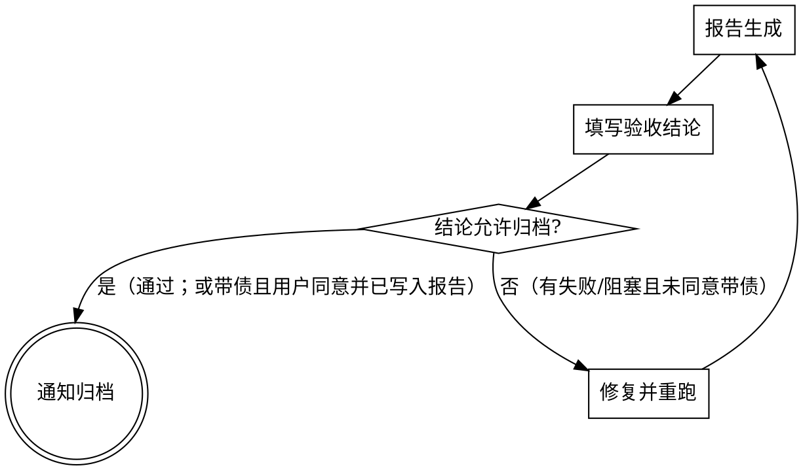

# Browser 交叉验证

使用 **Cursor 内置浏览器**（由 Cursor 内置的 Browser MCP 驱动，常见工具前缀为 `browser_*`）对前端页面做 E2E 交叉验证。与 TDD 的关系：TDD 保证「前端实现自洽」，本技能保证「页面行为与 spec 预期一致」。

## 自动化通道：必须使用 Cursor 内置浏览器（不用 `chrome-devtools-mcp`）

- **本技能规定的 UI 自动化方式**：仅使用 **Cursor 内置浏览器**（Agent 可调用的 **`cursor-ide-browser`** 一类工具，如 `browser_navigate`、`browser_snapshot`、`browser_click`、`browser_fill` 等）。**不要**使用用户在 **`~/.cursor/mcp.json` 里自行配置的 `chrome-devtools-mcp`（或同类外部 Chrome DevTools MCP）** 来执行本流程中的 E2E 步骤——两者用途区分，避免混淆。
- **为何 `mcp.json` 里没有 `cursor-ide-browser`**：内置浏览器能力由 Cursor **产品侧提供**，**通常不会**作为一行配置出现在 `mcp.json`；与 API、Feishu 等「用户手动添加的 MCP」不是同一类。看不到该项**不代表**未启用内置浏览器，以 Agent 当次会话是否暴露 `browser_*` / `cursor-ide-browser` 工具为准。
- **若内置浏览器工具不可用**：在报告中说明「内置浏览器自动化未执行」，引导用户**升级 Cursor**、在 **Settings** 中检查与 **Browser / Agent** 相关的开关；可改为**用户手动**在内置浏览器或外部浏览器中按清单验收并记录结果。**除非用户明确要求**，否则**不**将 `chrome-devtools-mcp` 作为本技能的替代自动化方案。

## 触发条件

**触发语示例**：
- 常规触发："跑自动化验证" / "跑e2e" / "浏览器验证一下" / "跑一下 `<change-id>` 的e2e"
- 延迟触发："用这个spec跑e2e `<链接/路径>`" / "按这个测试用例验证一下"（后跟 spec 内容）

**与 dev-workflow 的衔接**：

| 入口 | 说明 |
|------|------|
| **用户主动命令** | 用户直接要求跑 e2e / 浏览器验证 → 进入本技能 |
| **测试 spec 拉取后** | `pull-spec` 写入 `qa-*.md` 并解析后，可**询问用户**是否马上做交叉验证；**仅用户确认后**再进入本技能（禁止未确认就自动打开浏览器自动化） |

## 定位验证依据

E2E 验证需要 spec 文件作为验证依据。根据触发场景不同，定位方式不同：

| 场景 | 处理方式 |
|------|---------|
| 用户触发语中包含 change-id | 直接使用，如「跑一下 add-refund-detail 的 e2e」 |
| 仅 1 个变更目录 | 自动选定 |
| 多个变更目录 | 列出所有 change-id，请用户选择 |
| **无变更目录（延迟触发）** | **请用户指定 spec 来源**（见下方） |

### 延迟触发场景

代码已提交、工作区无活跃变更目录时（变更已归档或在其他分支完成），用户须手动指定验证依据：

- **指定 spec 文件路径**：「用 `path/to/spec.md` 跑 e2e」
- **指定 GitLab 链接**：「用这个 spec 跑 e2e `<GitLab链接>`」→ 使用 `pull-spec` 拉取后作为验证依据
- **直接粘贴 spec 内容**：用户粘贴测试场景文本，直接作为验证清单

延迟触发时跳过变更目录扫描，直接以用户提供的 spec 生成验证清单。

### 多份 spec 与置信度优先级

在变更目录完整时，应**同时阅读**（若存在）：

1. **`qa-*.md`（测试 spec）** — **置信度最高**，作为验收与 Browser 场景的**主依据**
2. **`specs/*/spec.md`（前端 spec）** — 与测试 spec 对照，补全场景与边界
3. **`backend-*.md`（后端 spec，如有）** — 与接口/错误码相关预期对照

**冲突处理**：若前端实现、后端行为或前端 spec 与 **测试 spec** 不一致，在验证报告与结论中**必须显著提示**（见报告模板「与测试 spec 的差异」小节），不得以「仅前端 spec 为准」默默忽略测试 spec。

## 流程

### 步骤 1：生成验证清单与对比

**情况 A — 存在测试 spec（`qa-*.md`）**：

1. 读取 `qa-*.md` 中的所有测试场景
2. 读取 `specs/*/spec.md` 中的 Scenario（如有）
3. 读取 `backend-*.md` 中与 UI/接口结果相关的条目（如有）
4. 对比生成三类清单：

| 类型 | 含义 |
|------|------|
| **共有** | 测试 spec 与前端 spec 都覆盖的场景 |
| **测试增量** | 测试 spec 有但前端 spec 未覆盖的场景（QA 盲区） |
| **前端独有** | 前端 spec 有但测试 spec 未提及的场景（可选验证） |

验证范围：共有 + 测试增量（必须全部执行），前端独有（可选）。

**情况 B — 无测试 spec**：

1. 读取 `specs/*/spec.md` 中的所有 Scenario
2. 所有前端 spec Scenario 即为完整验证范围
3. 验证报告中标注「基于前端 spec，未经 QA 交叉验证」

### 步骤 2：TDD / 静态验证清单（优先）

在进入浏览器自动化前，**按清单逐项核对**并给出**文字结论**（可表格形式）：

| 检查项 | 说明 |
|--------|------|
| **L1/L2 等 TDD 测试** | 若项目已配置并存在相关测试，**先运行**并记录通过/失败/跳过；失败项优先修代码再谈 E2E |
| **无单元测试工具** | 多数前端项目**没有**或仅少量单元测试；此时在本节**明确写出**「未配置单元测试 / 未执行」，**不得虚构**已跑测试 |
| **与 spec 一致性（静态）** | 基于 `qa-*` / 前端 spec / `backend-*` 做**文档与代码的静态对照**（能确定的接口、路由、文案等），记录疑点供浏览器验证 |

输出：**验证清单结论**（含 TDD 结果或「无单元测试环境」说明），作为进入浏览器自动化前的**前置小节**。

### 步骤 3：用户二次确认（Browser 自动化开关）

在**验证清单结论**产出后：

1. **必须**向用户展示清单结论摘要，并**询问是否执行 Cursor 内置浏览器的 UI 自动化**（`browser_*` 工具；逐场景导航、点击、填写、截图等）。
2. **用户未明确同意前**，不调用浏览器 MCP 做自动化操作（可仅输出清单与计划）。
3. 用户拒绝或仅要静态审查时：只生成报告中的「清单结论」部分，Browser 步骤标为「未执行」。

### 步骤 4：登录与页面就绪（人工引导 + Agent 接管）

若缺少**账号、登录态、环境 URL、或直达待验收页**的信息：

1. **引导用户**在 **Cursor 内置浏览器**中**手动**完成登录、选择环境、导航到**待验收页面**（或可复制 URL 后由 `browser_navigate` 打开）。
2. 用户表示「已就绪」或当前页面已停在正确上下文后，**Agent 再接管**后续自动化：基于 **`browser_snapshot`** 等内置工具继续执行步骤 5。
3. 若存在 **blocker**（验证码、SSO、无权限），停止自动化并如实写入报告，提示用户处理后再继续。

### 步骤 5：执行 Browser 自动化（用户已确认后）

使用 **Cursor 内置 Browser MCP**（**`cursor-ide-browser`**，工具如 `browser_navigate`、`browser_snapshot`、交互类 `browser_*`）**按验证清单中的场景逐一执行**（与用户确认后执行）。**不**使用 `mcp.json` 中的 **chrome-devtools-mcp** 作为本流程的执行手段。

对每个待验证场景，先生成操作计划（见下），再执行：

```markdown
### Scenario: <场景名>
- 来源: qa-spec / 前端spec / 共有
- 前置: <需要的页面状态或数据>
- 操作步骤:
  1. 导航到 <URL>
  2. <操作描述>（点击/填写/选择）
  3. ...
- 验证点:
  - THEN: <期望的页面展示>
  - AND: <附加验证>
```

执行步骤（**内置浏览器**；以 Cursor 实际暴露的 `browser_*` 工具为准）：

1. `browser_navigate` 到目标页面（或用户已手动就绪的当前页）
2. `browser_snapshot` 获取页面结构与可交互引用
3. 按操作步骤交互（`browser_click`、`browser_fill` 等）
4. `browser_snapshot` + `browser_take_screenshot`（若可用）验证结果
5. 对比 THEN 条件与实际页面状态

**注意**：
- 每次交互后需重新获取 snapshot
- 截图保存为验证证据
- 遇到需要登录等 blocker 时停止并报告

### 步骤 6：输出验证报告

报告须包含：**验证清单结论**（步骤 2）+ **Browser 自动化结果**（若执行）+ **显著差异提示**。

```markdown
## 自动化验证报告

**变更**: <change-id>
**执行时间**: <YYYY-MM-DD HH:mm>
**验证范围**: 共有 N 条 + 测试增量 M 条

### 验证清单结论（TDD / 静态）
- TDD：<通过/失败/跳过/未配置单元测试 — 简要说明>
- 静态对照：<与 qa/前端/backend 文档核对后的要点摘要>

### ⚠️ 与测试 spec 的显著差异（如有则必填）
> 当前实现或前端/后端 spec 与 **qa-*.md** 不一致处，逐条列出（接口、文案、流程、错误码等），**禁止**用小字隐藏。

| 测试 spec 预期 | 实际实现或其它 spec 差异 | 结论 |
|----------------|---------------------------|------|
| ... | ... | ... |

### 通过 (X/Y)
- ✅ Scenario: <场景名> — <简述>
- ✅ ...

### 失败 (X/Y)
- ❌ Scenario: <场景名>
  - 期望: <THEN 条件>
  - 实际: <页面实际状态>
  - 截图: <截图路径>

### 前端盲区（测试 spec 有，前端 spec 无）
- ⚠️ Scenario: <场景名> — 前端未覆盖，建议补充

## 验收结论（必填）

> 本块为归档门禁的**单一判读处**：`dev-workflow` / Rule 以本节为准，不单独猜「通过/失败」小节是否为空。

- **结论**：`通过` / `不通过`
- **阻塞项**：<仍有未关闭的失败场景或 blocker 时逐条列出；无则写「无」>
- **归档说明（宽松版）**：
  - 默认：**结论为 `通过`** 且 **阻塞项为「无」** → 可进入 `openspec archive`。
  - **结论为 `不通过`** 或 **阻塞项非空** 时：默认**先修复并重跑**至通过后再归档。
  - **例外**：仅当用户**在本对话中明确同意「带已知问题归档」**时，可将结论仍为 `不通过` 的变更归档；须在本条写明 **用户同意时间与已知问题摘要**，并确保上文「失败」小节与阻塞项已完整保留，不得隐瞒。

（生成报告时根据「通过/失败」清单与是否仍有 blocker 填写；最后一轮定稿后再写入文件。）
```

报告写入 `openspec/changes/<change-id>/e2e-report.md`。

### 步骤 7：处理结果

**默认路径**：存在失败项 → 优先修复代码 → 重跑失败场景 → 直至 **验收结论** 可为「通过」且无阻塞项 → 再通知可归档。

**宽松版**：若仍存在失败或阻塞项，但用户**明确同意带已知问题归档**，须在 **`## 验收结论`** 中记录同意与摘要（见模板「归档说明」）；**不得**在未记录的情况下代为归档。



- **可归档**指：`验收结论` 为 **通过**（阻塞项无），或 **不通过**但已按模板记录 **用户同意带已知问题归档**。
- 验证报告写入变更目录后，**仅当**满足上条时再提示用户执行 `openspec archive`。

## 与 TDD 的分工

| 维度 | TDD（阶段3） | Browser 交叉验证（本技能） |
|------|-------------|------------------------|
| 视角 | 开发者自身理解 | QA 的预期标准（**qa 为主**） |
| 层级 | 单元/组件级（若存在） | 页面/E2E 级 |
| 数据 | mock → 真实 API | 真实 API（联调环境） |
| 依据 | 前端 spec Scenario | **测试 spec** 优先；否则前端 spec；**backend-*.md** 辅助对照 |
| 目的 | 实现正确性 | 提测前交叉覆盖；**与测试 spec 冲突须显著报告** |
| 浏览器自动化 | — | **仅 Cursor 内置浏览器**（不用 `mcp.json` 里的 chrome-devtools-mcp） |
