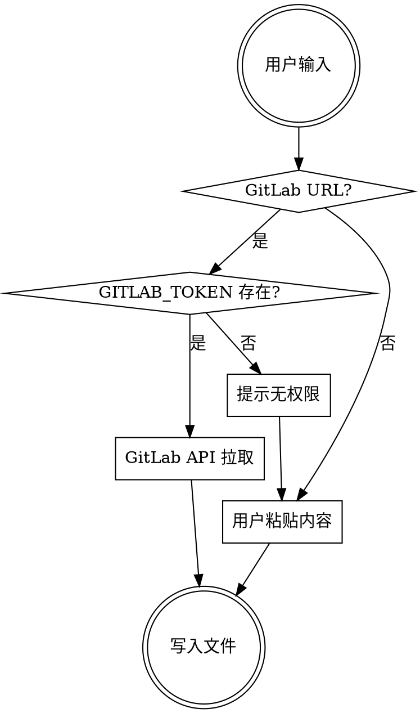

# 拉取外部 Spec

从 GitLab 仓库拉取 spec 文件。本技能有**两种使用时机**：

| 时机 | 场景 | 行为差异 |
|------|------|----------|
| **阶段 1（设计探索）** | 用户提供 GitLab URL 指向**产品/业务需求 Spec** 作为需求来源 | **仅读取内容**作为 brainstorming 输入材料，**不写入** `openspec/changes/`（此时变更目录尚未创建）；来源 URL 后续记入 `proposal.md` 的 `References`。 |
| **T1 后（事件驱动）** | 后端 spec 或测试 spec 到达 | **写入** `openspec/changes/<change-id>/`（`backend-*.md` 或 `qa-*.md`），并做差异分析。 |

以下流程主要描述 **T1 后写入模式**（阶段 1 的读取模式由 `dev-workflow` 步骤 1b 调用，使用相同的 GitLab API 机制但跳过「定位变更目录」与「写入」步骤）。

## 前后端与 QA 的复用方式（目录规范一致）

- **团队约定**：无论**前端仓库**还是**后端仓库**，针对**同一需求**应使用**同一 `change-id`**，并在各自仓库内将外部拉取的 spec 落在 **`openspec/changes/<change-id>/`** 下（与 `proposal.md` 同级），**不得**随意写到其它目录。这样联调、评审、归档时前后端指向同一套变更文件夹语义。
- **测试/QA spec**：拉取后统一命名为 `qa-*.md`，写入路径为 **`openspec/changes/<change-id>/qa-*.md`**；后端侧与前端侧**标准相同**——都是「当前需求」的 spec 目录，不是后端另起一套路径。
- **GitLab 源文件**仍是共享真相；**落地路径**在前后端各自仓库中保持上述结构。后端开发者可使用本 `pull-spec` 技能（与前端相同流程）或手工复制到同一路径，但必须保证 **`<change-id>` 与前端对齐**。

## 输入

用户提供以下任一形式：

1. **GitLab 文件 URL**（首选）：`https://gitlab.example.com/group/repo/-/blob/branch/path/to/spec.md`
2. **直接粘贴内容**（降级）：用户直接粘贴 spec 文本

## 定位目标变更

拉取前**必须**先确定写入哪个变更目录，禁止写到变更目录以外的位置。

```bash
find openspec/changes -maxdepth 2 -name proposal.md 2>/dev/null
```

| 场景 | 处理方式 |
|------|---------|
| 仅 1 个变更目录 | 自动选定 |
| 多个变更目录 | 列出所有 change-id，请用户选择 |
| 用户触发语中包含 change-id | 直接使用，如「add-refund-detail 的后端spec到了」 |
| 无变更目录 | **拒绝执行**，提示用户先完成设计探索（阶段 1）创建变更 |

定位后锁定写入路径为 `openspec/changes/<change-id>/`，后续所有文件操作均在此目录内完成。

## 流程

### 步骤 1：识别来源类型



### 步骤 2：拉取内容

**首选 — GitLab API**（使用本地 `GITLAB_TOKEN`）：

1. 检查环境变量 `GITLAB_TOKEN` 是否存在：
   ```bash
   echo ${GITLAB_TOKEN:+ok}
   ```
   - 输出 `ok` → 继续
   - 无输出 → 提示用户「未检测到 GITLAB_TOKEN 环境变量，请先配置或直接粘贴 spec 内容」，转降级方案

2. 从 GitLab URL 中解析参数：
   - `https://gitlab.example.com/group/repo/-/blob/branch/path/to/file.md`
   - 提取 `gitlab-host`、`group/repo`（URL 编码为 `group%2Frepo`）、`branch`、`file-path`（URL 编码）

3. 调用 GitLab API 拉取文件：
   ```bash
   curl -sf --header "PRIVATE-TOKEN: $GITLAB_TOKEN" \
     "https://<gitlab-host>/api/v4/projects/<group%2Frepo>/repository/files/<file-path>/raw?ref=<branch>"
   ```

4. 如果返回 `403`/`404` → 提示用户「Token 无权限访问该仓库或文件不存在，请检查权限或直接粘贴 spec 内容」

**降级 — 用户粘贴**：

当 `GITLAB_TOKEN` 未配置或无权限时，请用户直接粘贴 spec 文本内容。

### 步骤 3：写入本地

**命名规范**：
- 后端 spec → `backend-<描述性名称>.md`
- 测试 spec → `qa-<描述性名称>.md`

**文件头部**（自动注入）：

```markdown
<!-- pull-spec metadata -->
<!-- source: <GitLab URL 或 "user-paste"> -->
<!-- commit: <commit hash 或 "N/A"> -->
<!-- pulled_at: <YYYY-MM-DD HH:mm> -->
<!-- WARNING: 此文件为外部 spec 副本，实现以源仓库为准 -->
```

**写入路径**：`openspec/changes/<change-id>/`（与 proposal.md 同级）。

**路径约束**：
- **必须**写入上一步定位的变更目录，**禁止**写到项目根目录或其他位置
- 写入前验证目标目录存在 `proposal.md`，不存在则中止并报告
- 写入后用 `ls openspec/changes/<change-id>/` 确认文件已落盘

### 步骤 4：差异分析

拉取完成后自动执行：

1. 读取已有的 `proposal.md` 中前端 API 契约段落
2. 读取拉取的外部 spec
3. 对比差异，输出：
   - **一致**：前端契约与外部 spec 吻合
   - **差异**：列出字段名/类型/错误码的不同
   - **增量**：外部 spec 有但前端未覆盖的内容
4. 如果有差异，建议更新 mock 数据或前端 spec Scenario

## 归档注意

归档时须随变更目录保留所有 `backend-*.md` 和 `qa-*.md` 文件。
