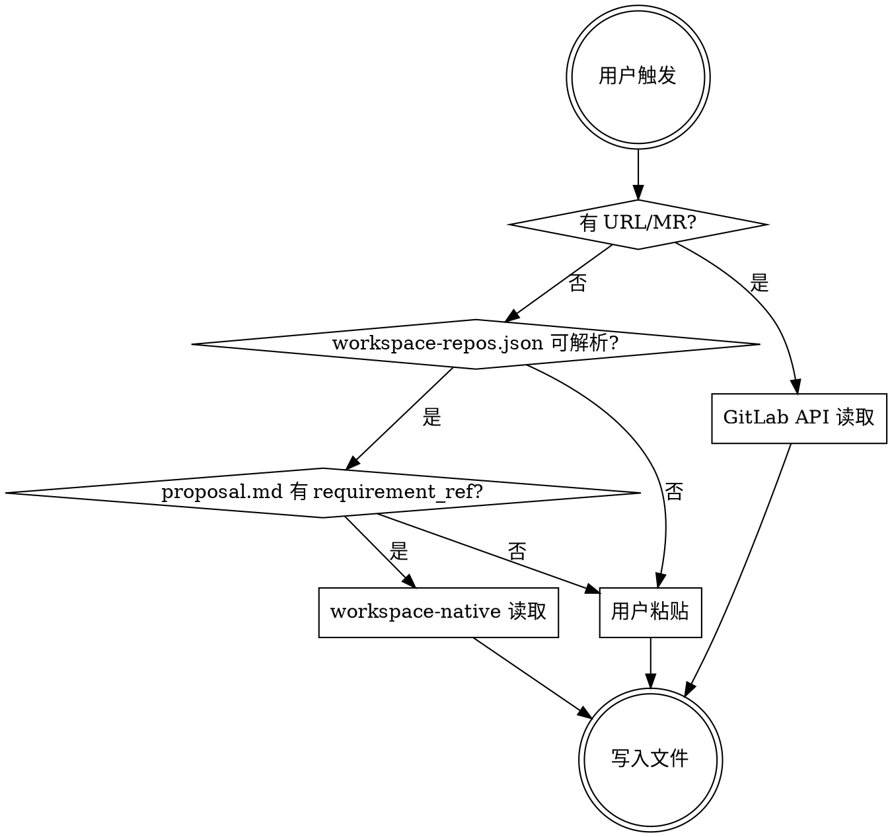

# 拉取外部 Spec（workspace-aware）

从工作区本地仓库或 GitLab 仓库拉取 spec 文件。本技能有**两种使用时机**：

| 时机 | 场景 | 行为差异 |
|------|------|----------|
| **阶段 1（设计探索）** | 用户提供 GitLab URL 指向**产品/业务需求 Spec** 作为需求来源 | **仅读取内容**作为 brainstorming 输入材料，**不写入** `openspec/changes/`（此时变更目录尚未创建）；来源 URL 后续记入 `proposal.md` 的 `References`。 |
| **T1 后（事件驱动）** | 后端 spec 或测试 spec 到达 | **写入** `openspec/changes/<change-id>/`（`backend-*.md` 或 `qa-*.md`），并做差异分析。 |

以下流程主要描述 **T1 后写入模式**（阶段 1 的读取模式由 `dev-workflow` 步骤 1b 调用，使用相同机制但跳过「定位变更目录」与「写入」步骤）。

## 三级读取策略

开发者无需关心"我在工作区还是单项目"，`pull-spec` 自动选择最优路径：

| 优先级 | 策略 | 条件 | 体验 |
|--------|------|------|------|
| 1 | **workspace-native** | 工作区可解析 **`workspace-repos.json`**（仓库根或 `scripts/workspace-repos.json`，与 `references/workspace-native.md` 一致）且可达目标仓库 | 零手动输入 |
| 2 | **GitLab API** | 用户提供 URL 或 MR 链接 | 给个链接即可 |
| 3 | **用户粘贴 / @ 工作区文件** | 上述均不可用，或用户 @ 注入正文 | 兜底（与粘贴等价） |

## 前后端与 QA 的复用方式（目录规范一致）

- **团队约定**：无论**前端仓库**还是**后端仓库**，针对**同一需求**应使用**同一 `change-id`**，并在各自仓库内将外部拉取的 spec 落在 **`openspec/changes/<change-id>/`** 下（与 `proposal.md` 同级），**不得**随意写到其它目录。
- **测试/QA spec**：拉取后统一命名为 `qa-*.md`，写入路径为 **`openspec/changes/<change-id>/qa-*.md`**。
- **GitLab 源文件**仍是共享真相；**落地路径**在前后端各自仓库中保持上述结构。

## 输入

用户提供以下任一形式（或不提供，由 workspace-native 自动发现）：

1. **无显式输入**（workspace-native 自动发现）：用户仅说"后端 spec 到了"或"测试 spec 到了"
2. **GitLab 文件 URL**：`https://gitlab.example.com/group/repo/-/blob/branch/path/to/spec.md`
3. **GitLab MR URL**：`https://gitlab.example.com/group/repo/-/merge_requests/123`（自动提取 source branch）
4. **直接粘贴内容**（降级）：用户直接粘贴 spec 文本
5. **Cursor @ 工作区文件**（与策略 3 等价）：用户在对话中 **@** 任意已加入多根工作区的 **spec 类文件**（不限仓库：可为 specs 仓库的需求/测试文档，或其它根目录下的 **后端接口说明、OpenAPI 片段、前端契约、兄弟仓 spec** 等 Markdown/文本）。编辑器将**文件正文注入上下文**，视为已提供 spec 全文并走 **策略 3** 落盘；**不**单独作为 workspace-native（无自动 `git show` 元数据）。多人协作时，应先在**该文件所在仓库** **pull / 切到约定分支**，再 @，避免基于过期副本写入。

**@ 时由 Agent 推断落盘类型（勿写死为某一种文档）**：综合 **用户触发语**（如「测试 spec 到了」「后端 spec」）、**路径**（如 `requirements/`、`openspec/`、`specs/`）、**正文结构**（MODULE、接口路径、契约表格等）及 **当前会话所在代码仓库角色**（本技能多用于前端仓库），自动判断应写入 `qa-*.md`、`backend-*.md` 等命名规范中的哪一类，并选择步骤 5 的差异分析视角；**若无法唯一判断，先列出选项请用户确认再写入**。

## 定位目标变更

拉取前**必须**先确定写入哪个变更目录，禁止写到变更目录以外的位置。

```bash
find openspec/changes -maxdepth 2 -name proposal.md 2>/dev/null
```

| 场景 | 处理方式 |
|------|---------|
| 仅 1 个变更目录 | 自动选定 |
| 多个变更目录 | 列出所有 change-id，请用户选择 |
| 用户触发语中包含 change-id | 直接使用，如「add-refund-detail 的后端spec到了」 |
| 无变更目录 | **拒绝执行**，提示用户先完成设计探索（阶段 1）创建变更 |

定位后锁定写入路径为 `openspec/changes/<change-id>/`，后续所有文件操作均在此目录内完成。

## 流程

### 步骤 1：判断读取策略


```dot
digraph pull {
  "用户触发" [shape=doublecircle];
  "有 URL/MR?" [shape=diamond];
  "workspace-repos.json 可解析?" [shape=diamond];
  "proposal.md 有 requirement_ref?" [shape=diamond];
  "workspace-native 读取" [shape=box];
  "GitLab API 读取" [shape=box];
  "用户粘贴" [shape=box];
  "写入文件" [shape=doublecircle];

  "用户触发" -> "有 URL/MR?";
  "有 URL/MR?" -> "GitLab API 读取" [label="是"];
  "有 URL/MR?" -> "workspace-repos.json 可解析?" [label="否"];
  "workspace-repos.json 可解析?" -> "proposal.md 有 requirement_ref?" [label="是"];
  "workspace-repos.json 可解析?" -> "用户粘贴" [label="否"];
  "proposal.md 有 requirement_ref?" -> "workspace-native 读取" [label="是"];
  "proposal.md 有 requirement_ref?" -> "用户粘贴" [label="否"];
  "workspace-native 读取" -> "写入文件";
  "GitLab API 读取" -> "写入文件";
  "用户粘贴" -> "写入文件";
}
```

触发语中若含 **@ 文件** 而无 URL，且不满足 workspace-native 条件，则与「用户粘贴」走同一出口。

### 步骤 2：拉取内容

#### 策略 1：workspace-native 读取（零手动输入）

当用户未提供 URL，且工作区内能按 `references/workspace-native.md`「前置检查」解析到 **`workspace-repos.json`（根目录或 `scripts/`）** 且 `proposal.md` 含 `requirement_ref` 时自动触发。

分两种子场景：**A. 测试 spec**（从 specs 仓库读取，**优先 `origin/main`，再 `origin/master`**，均失败则分支发现）、**B. 对方 API spec**（跨仓库 `git fetch` + 分支发现 + `git show`，不 checkout）。任一步骤失败则自动降级到策略 2 或 3。

> **完整 git 命令、分支发现逻辑、MODULE 切片、降级路径**见 `references/workspace-native.md`。

#### 策略 2：GitLab API 读取

当用户提供 GitLab 文件 URL 或 MR URL 时使用。

1. 检查环境变量 **`GITLAB_TOKEN`** 或 **`GITLAB_PRIVATE_TOKEN`**（与 **aicr-local** 一致，至少其一非空）：
   ```bash
   test -n "${GITLAB_TOKEN:-$GITLAB_PRIVATE_TOKEN}"
   ```
   - 退出码 0 → 继续
   - 非 0 → 提示用户配置 `GITLAB_TOKEN` 或 `GITLAB_PRIVATE_TOKEN`，或粘贴内容

2. **文件 URL**：从 URL 中解析 `gitlab-host`、`group/repo`、`branch`、`file-path`，调用 GitLab API：
   ```bash
   curl -sf --header "PRIVATE-TOKEN: ${GITLAB_TOKEN:-$GITLAB_PRIVATE_TOKEN}" \
     "https://<gitlab-host>/api/v4/projects/<group%2Frepo>/repository/files/<file-path>/raw?ref=<branch>"
   ```

3. **MR URL**：提取 project + MR iid，通过 API 获取 source branch，再拉取文件：
   ```bash
   # 获取 MR 信息
   curl -sf --header "PRIVATE-TOKEN: ${GITLAB_TOKEN:-$GITLAB_PRIVATE_TOKEN}" \
     "https://<gitlab-host>/api/v4/projects/<project-id>/merge_requests/<mr-iid>"
   # 从 source_branch 拉取 spec 文件
   ```

4. 返回 `403`/`404` → 提示用户检查权限或粘贴内容

#### 策略 3：用户粘贴 / @ 工作区文件（兜底）

当策略 1、2 均不可用时：请用户**直接粘贴** spec 文本；或用户已在消息中 **@** 工作区文件，则使用对话中的文件正文作为 spec 源（**任意仓库、任意相对路径**，见上文「@ 时由 Agent 推断落盘类型」）。

**@ 与粘贴的元数据**（写入步骤 4 文件头）：

- `source`：优先写 `workspace-file@<所在仓库>:<相对路径>` 或 `workspace-file@<相对路径>`；若无法可靠解析路径，写 `"user-paste"`。
- `ref` / `commit`：若 Agent 能在该文件所在仓库执行 `git rev-parse HEAD` 且路径属该仓库，可填当前 HEAD；否则填 `N/A` 并依赖人工确认文档已最新。

### 步骤 3：MODULE 切片（如适用）

`proposal.md` 含 `modules` 字段时，按 MODULE 过滤测试场景（保留公共部分）。无 `modules` 则保留完整内容。详见 `references/workspace-native.md`。

### 步骤 4：写入本地

**命名规范**：
- 后端 spec → `backend-<描述性名称>.md`
- 测试 spec → `qa-<描述性名称>.md`

**文件头部**（自动注入）：

```markdown
<!-- pull-spec metadata -->
<!-- source: <GitLab URL / workspace-native / workspace-file@<path> / "user-paste"> -->
<!-- ref: <branch or ref name, 如 refs/remotes/origin/feat/xxx> -->
<!-- commit: <commit hash 或 "N/A"> -->
<!-- pulled_at: <YYYY-MM-DD HH:mm> -->
<!-- WARNING: 此文件为外部 spec 副本，实现以源仓库为准 -->
```

**写入路径**：`openspec/changes/<change-id>/`（与 proposal.md 同级）。

**路径约束**：
- **必须**写入上一步定位的变更目录，**禁止**写到项目根目录或其他位置
- 写入前验证目标目录存在 `proposal.md`，不存在则中止并报告
- 写入后用 `ls openspec/changes/<change-id>/` 确认文件已落盘

### 步骤 5：差异分析

拉取完成后自动执行：

1. 读取已有的 `proposal.md` 中前端 API 契约段落
2. 读取拉取的外部 spec
3. 对比差异，输出：
   - **一致**：前端契约与外部 spec 吻合
   - **差异**：列出字段名/类型/错误码的不同
   - **增量**：外部 spec 有但前端未覆盖的内容
4. 如果有差异，建议更新 mock 数据或前端 spec Scenario

## 归档注意

归档时须随变更目录保留所有 `backend-*.md` 和 `qa-*.md` 文件。
