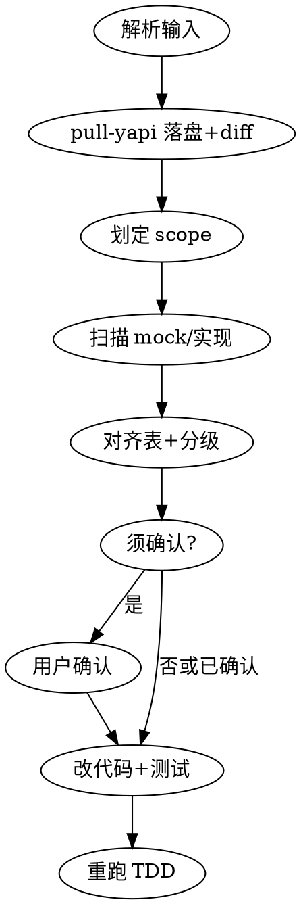

# re-check — YApi 与实现对齐

将 **mock / 占位 API 实现** 与 **YApi 真契约** 校对，并在用户确认后更新代码与测试。与 **`pull-yapi`** 分工：

| 技能 | 层级 | 改业务代码？ | 典型产出 |
|------|------|--------------|----------|
| **pull-yapi** | 文档 / 契约 | **否** | `backend-yapi-<slug>.md` + proposal diff 报告 |
| **re-check**（本技能） | 实现 / 联调对齐 | **是**（在 scope 内） | 对齐表 → 改 API 层/mock/L1/L2 → 重跑 TDD |

> **入口**：本插件 **Commands 仅 `/fe-sdd`**。本技能通过自然语言、`dev-workflow` 无感路由或用户点名 `re-check` 触发。

## 触发

| 类型 | 条件 | 动作 |
|------|------|------|
| **显式** | `re-check`、`对齐 YApi`、`YApi 接口到了`、`继续对齐接口` + 可选飞书/YApi 链接 | 本技能全流程 |
| **无感 A** | 消息含飞书或 YApi 链接/ID，且能**唯一**定位 `openspec/changes/<change-id>/` | 若 scope 内有 mock/占位或 `contract_source: inferred` → 本技能；若用户明确「只拉文档/落盘」→ 仅 **pull-yapi** |
| **无感 B** | `tasks.md` 全 `[x]` + 事件 A 语义（YApi/后端接口到了） | 默认本技能（内含 pull-yapi） |
| **T1 未完成** | 用户贴 YApi 且要对齐实现 | **允许** re-check；scope 仍遵守 §范围；破坏性变更仍须确认 |

**不触发 pull-yapi-only 的情况**：用户明确「只拉 YApi 契约」「只落盘」「不要改代码」。

## 前置：定位变更目录

```bash
find openspec/changes -maxdepth 2 -name proposal.md 2>/dev/null
```

| 场景 | 处理 |
|------|------|
| 0 个 | 拒绝；提示先 `/fe-sdd` + `design-to-opsx` 或指定 change-id |
| 1 个 | 自动选定 |
| 多个 | 列出 change-id 请用户选择 |
| 触发语含 change-id | 直接使用 |

## 流程概览



### 步骤 1：解析输入

按优先级收集 YApi 链接/ID：

1. 用户消息中的 **YApi URL** / **interfaceID**
2. 用户消息中的 **飞书 URL** → feishu-mcp 读正文 → 提取全部 YApi 链接/ID
3. `proposal.md` 的 `References` → `YApi 接口:` 段
4. 变更目录已有 `backend-yapi-*.md`（可 refresh，仍须走 pull-yapi MCP 若用户给了新链）

无新链接且仅有旧落盘文件：可读现有 `backend-yapi-*.md`，但 **SHOULD** 提示用户是否 refresh MCP。

### 步骤 2：契约落盘（REQUIRED SUB-SKILL: pull-yapi）

对每个接口调用 **`pull-yapi`**（T1 后落盘模式）：

- 写入/更新 `backend-yapi-<slug>.md`
- 对 `proposal.md` **API 契约（前端期望）** 输出一致/差异/增量

**本步骤不得修改** `.vue/.ts/.tsx/.jsx/.js` 等业务实现文件（纪律在 pull-yapi 中同样适用；re-check 从步骤 3 起才可改代码）。

### 步骤 3：划定 scope（仅改当前需求）

1. **优先**：`proposal.md` frontmatter 的 `modules`（glob 路径）
2. **否则**：当前 feature 分支相对 `main`（或 proposal 中 `base_branch`）的 `git diff --name-only` 列表
3. **交集**：与 YApi path、`@fe-specflow: yapi-placeholder` 匹配到的文件
4. **modules 与 diff 皆空**：输出完整对齐表，**不自动改代码**，请用户 @ 文件或补全 `proposal.md`
5. **同 path 多候选**：列出文件请用户选择，**禁止**全仓库盲改

### 步骤 4：扫描 mock / 实现（推荐标记，不强制）

在 scope 内按优先级绑定 YApi path → 代码位置：

| 优先级 | 手段 |
|--------|------|
| P0 | `grep` `@fe-specflow: yapi-placeholder: <path>` |
| P1 | `grep` API path 字符串 |
| P2 | `proposal.md` API 契约中的接口名 ↔ 文件名/导出函数名 |
| P3 | mock 特征：`Promise.resolve`、`TODO.*Yapi`、`contract_source: inferred` 相关文件 |

**推荐注释**（T1 时应尽量添加，非 MUST）：

```ts
// @fe-specflow: mock-source
// @fe-specflow: yapi-placeholder: /api/order/create
// @fe-specflow: mock-fields: { orderId: string, amount: number }
```

对齐完成后 **SHOULD** 删除上述标记行或改为真实实现（无需保留 `yapi-aligned` 除非团队另有约定）。

### 步骤 5：对齐表与差异分级

输出 Markdown 对齐表，列：**YApi path | 匹配方式 | 文件 | 差异摘要 | 动作（自动/待确认/未绑定）**。

#### 须用户确认（破坏性 🔴）

- 响应字段**删除**或**重命名**
- 必填收紧（optional → required 且无默认）
- 字段**类型变更**
- HTTP **method** / **path** 变更

#### 可自动对齐（安全 🟢）

- 新增可选请求字段
- 新增响应字段
- mock/类型与 YApi 一致化（无上述破坏性）

#### 批量门禁（N=5）

若单次涉及 **≥3 个接口** 或预计修改 **≥5 个文件**：先输出**完整**对齐表，**一次性**请用户确认后再改代码。

未绑定接口标 ⚪：不猜测修改，请用户 @ 文件或补 `yapi-placeholder` 标记。

### 步骤 6：改代码与测试

在 scope 内且（无破坏性待确认 或 用户已确认）：

1. API 封装层：mock → 真实调用（或团队约定的 request 层）
2. 更新 **L1 契约测试**、**L2** 中依赖字段的用例
3. 更新 `proposal.md` **API 契约** 段（与 YApi 一致；注明 `contract_source: yapi`）
4. **全量重跑**本次变更相关的前端 TDD（L1 + L2）
5. 联调修复需提交时，走 `dev-workflow` **Git commit** 流程（用户确认 → add → 审查 → commit）

**字段纠偏权威**：与 pull-yapi / 决策 3a 一致——schema 以 YApi 为准；qa spec 验收口径仍以 qa 为最高（冲突写入报告，不静默覆盖 qa）。

### 步骤 7：完成摘要

向用户报告：

- 已对齐接口数 / 未绑定数
- 已改文件列表
- 测试重跑结果
- 仍待 YApi 或用户处理的项

## 与 dev-workflow 的关系

- **事件 A 默认**：「YApi 接口到了」「继续对齐接口」→ **本技能**（非仅 pull-yapi）
- **仅要文档**：用户明确只落盘 → **pull-yapi** only
- **阶段 1**：仍由 pull-yapi 只读；本技能假定已有 `openspec/changes/<change-id>/`

## MCP 与环境

与 **pull-yapi** 相同：`user-yapi-common-mcp`、`YAPI_BASE_URL`、`YAPI_GLOBAL_TOKEN`。MCP 失败时按 pull-yapi 降级表提示，**不得**静默跳过。

## 触发语示例

- `re-check` + 飞书文档链接
- `对齐 YApi` + 若干 interfaceURL
- `YApi 接口到了 <链接>`（tasks 已勾完或未勾完均可，见上表）
- `integrate-xxx 继续对齐接口`（含 change-id）
