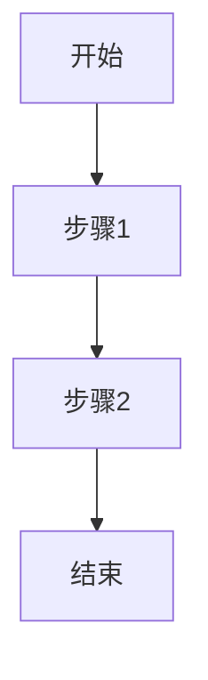

# prd.md 模板

prd.md 经历两个阶段：产品撰写（自由格式）→ `/pm-spec` 增强（阅读层 + MODULE 结构层）。

## 增强后完整结构

~~~markdown
# <需求标题>

> 确认时间: YYYY-MM-DD

## 开发速览

| 项目 | 内容 |
|------|------|
| 需求类型 | 新增 / 迭代 |
| 影响范围 | 页面 / 模块 / 流程 |
| 原型情况 | 有原型 / 无原型 |
| 建议阅读顺序 | MODULE-1 -> MODULE-2 |

## 关键变更摘要（可选，简洁）

- [新增] ...
- [修改] ...

## 主流程图

## 全局背景与约束

（产品原始背景、目标、约束，简洁表达）

## MODULE-1: <模块名> [新增/修改]

### 1) 需求描述
- ...

### 2) 变更点
- ...

### 3) 验收标准
- [ ] ...
- [ ] ...

### 4) 模块特有边界与异常（可选）
- ...

### 5) 引用
- 原型：prototypes/index.html#module-1
- 截图（推荐）：assets/module-1.png
- 流程节点：见主流程图第 1 步
- 无原型时：无原型（原因）

## MODULE-2: <模块名> [新增/修改]
...

## AI Review 结论

> [!IMPORTANT]
> 可开工结论：可开工 / 建议完善后开工 / 不可开工
>
> 评审时间：YYYY-MM-DD HH:mm
>
> 详细记录：prototypes/ai-review.md
~~~

## 要点

- 顶层“关键变更摘要”可选，但若存在必须简洁
- MODULE 标题仅使用 `[新增/修改]`，不加优先级字段
- 每个 MODULE 采用轻量 5 块结构，减少重复与冗余
- 文档避免大段文字，优先列表/表格/checklist/callout/流程图
- 默认开启 WYSIWYG 友好标记：checklist 和行内状态必开，callout/流程图按需
- 无截图不阻断：可先保留原型锚点，后续补齐截图引用
