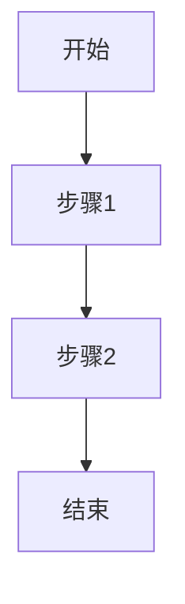

# prd.md 模板

prd.md 经历两个阶段：产品撰写（自由格式）→ `/pm-spec` 增强（阅读层 + MODULE 结构层）。

## 增强后完整结构

~~~markdown
# <需求标题>

> 确认时间: YYYY-MM-DD

## 开发速览

| 项目 | 内容 |
|------|------|
| 需求类型 | 新增 / 迭代（新增=全新能力全量评审；迭代=在已有产品上改动，AI Review 聚焦变更 MODULE） |
| 影响范围 | 页面 / 模块 / 流程（决定迭代需求下 Mermaid/场景检查粒度） |
| 原型情况 | 有原型 / 无原型 |
| 建议阅读顺序 | MODULE-1 -> MODULE-2 |

## 关键变更摘要（可选，简洁；迭代需求建议填写，供 AI Review 推断本轮变更 MODULE）

- [新增] MODULE-x：...
- [修改] MODULE-y：...

## 主流程图

## 全局背景与约束

（产品原始背景、目标、约束，简洁表达）

## 关键关注（必填）

> [!IMPORTANT]
> - <关键关注点 1>
> - <关键关注点 2（可选）>
> - <关键关注点 3（可选）>

## 回归范围（必填）

> [!NOTE]
> 说明本次变更需重点验证的既有能力，供开发与测试做回归。**禁止**仅写「无回归」等歧义表述。

- **需回归**：<页面 / 流程 / MODULE，及验证关注点；全新能力无存量影响时写「无既有能力受影响」并简述原因>
- **不纳入本次回归**：<明确范围 + 原因，如变更隔离在 MODULE-2、与 MODULE-1 无交互>

## MODULE-1: <模块名> [新增/修改]

### 1) 需求描述
- 目标用户：<角色/权限，一句话>
- 核心场景：<触发条件 → 操作 → 预期结果>
- 边缘/异常：<至少 1 条，业务需要时；可与块 4 合并>

### 2) 变更点
- ...

### 3) 验收标准
- [ ] ...
- [ ] ...

### 4) 模块特有边界与异常（可选）
- ...

### 5) 引用
- 原型：prototypes/index.html#module-1
- 截图（推荐）：assets/module-1.png
- 流程节点：见主流程图第 1 步
- 无原型时：无原型（原因）

## MODULE-2: <模块名> [新增/修改]
...

## AI Review 结论

> [!IMPORTANT]
> 可开工结论：可开工 / 建议完善后开工 / 不可开工
>
> 评审时间：YYYY-MM-DD HH:mm
>
> 详细记录：prototypes/ai-review.md
~~~

## 要点

- 顶层“关键变更摘要”可选，但若存在必须简洁
- 必须包含“关键关注（必填）”与“回归范围（必填）”区块；**禁止**在回归范围中仅写「无回归」，须写清需回归项或不纳入回归的范围与原因
- 不得仅在 AI Review 区体现重点
- MODULE 标题 `[新增/修改]` 表示**本次需求的变更模块**，不表示增量/存量；评审范围看 `开发速览.需求类型`
- 每个 MODULE 采用轻量 5 块结构，减少重复与冗余
- 严格禁止连续大段正文（>6 行）；需拆分为列表/表格/callout
- 复杂流程（存在分支逻辑，或步骤 >= 5）必须包含 Mermaid
- 默认开启 WYSIWYG 友好标记：checklist 和行内状态必开，callout 适量使用
- 无截图不阻断：可先保留原型锚点，后续补齐截图引用
